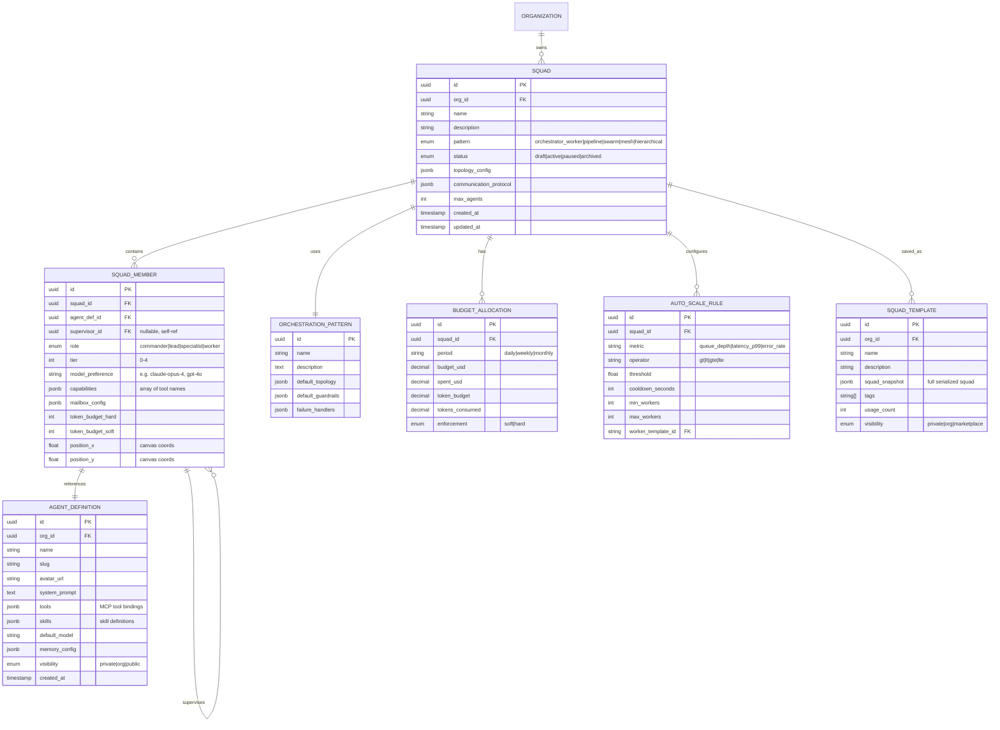
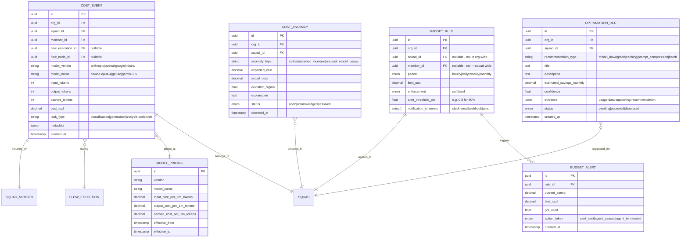
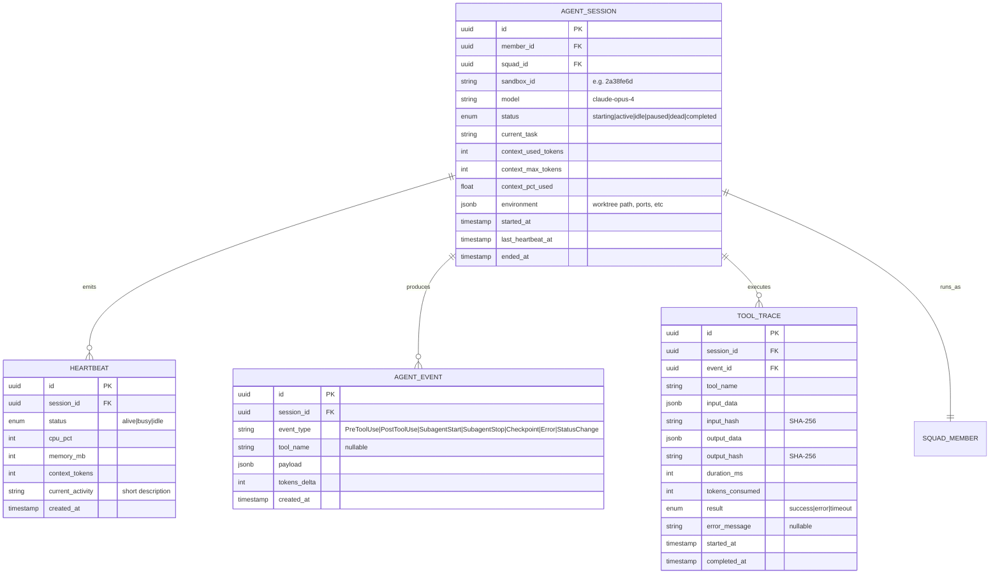
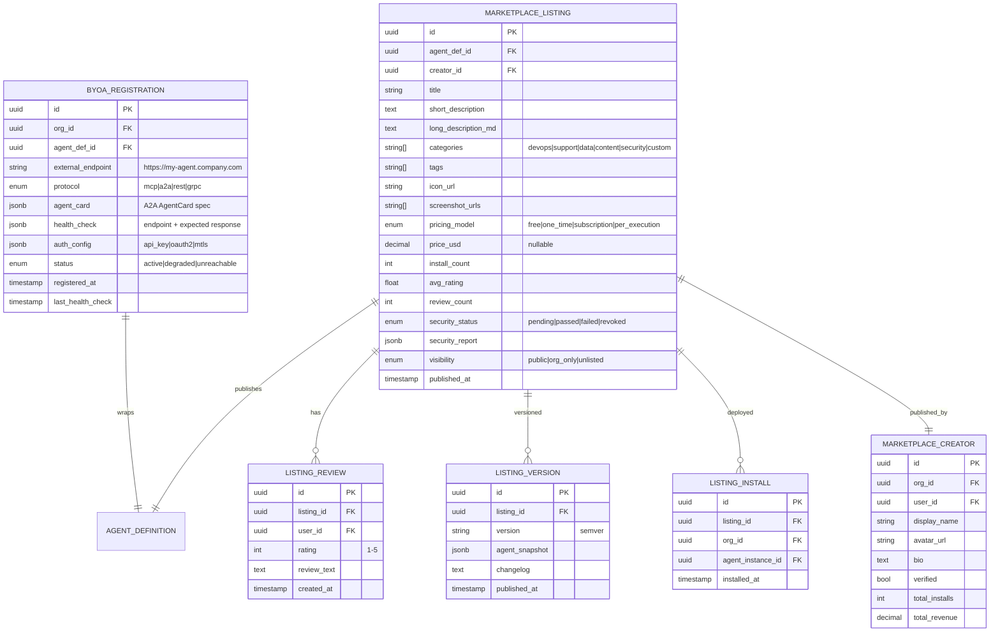
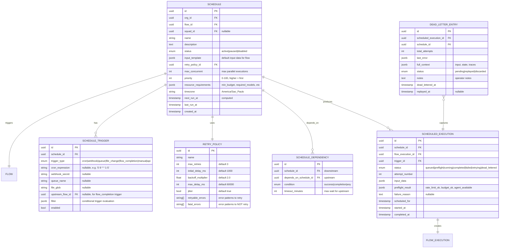
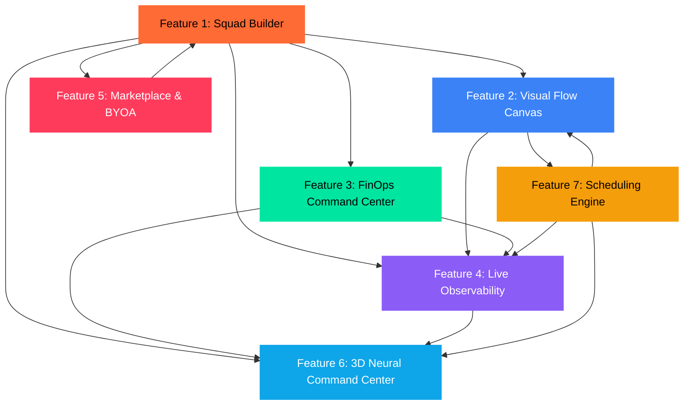
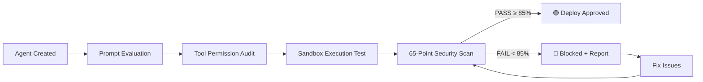

# AgentVerse — Phase 1 Initial Design

> **Document**: `BRAINSTORM_PHASE1_DESIGN.md`
> **Author**: Primary Designer
> **Date**: 2026-05-25
> **Status**: INITIAL DESIGN — Awaiting Reviewer Feedback
> **Revision**: 1.0

---

## Platform Commandments (Non-Negotiable)

1. **Never Either/Or — Always ALL**: Terminal AND Dashboard AND 3D AND API. Every feature ships across all four interaction modes simultaneously.
2. **Unlimited Drill-Down Depth**: Every metric is clickable to the deepest data level. No dead-ends.
3. **No Artificial Limitations**: If the customer can pay, we build it.

## Design Language

| Token | Value | Usage |
|-------|-------|-------|
| `--bg-abyss` | `#0c1017` | Primary background |
| `--bg-surface` | `#131a24` | Cards, panels |
| `--bg-elevated` | `#1a2332` | Modals, drawers |
| `--accent-fire` | `#FF6B35` | Active state, CTA, warnings |
| `--accent-mint` | `#00E5A0` | Success, positive delta |
| `--accent-danger` | `#FF3B5C` | Errors, critical alerts |
| `--accent-info` | `#3B82F6` | Links, info states |
| `--accent-purple` | `#8B5CF6` | AI/agent markers |
| `--text-primary` | `#E2E8F0` | Body text |
| `--text-muted` | `#64748B` | Secondary text |
| `--glass-blur` | `backdrop-filter: blur(12px); background: rgba(19,26,36,0.7)` | Glassmorphism panels |
| `--border-glow` | `box-shadow: 0 0 20px rgba(accent, 0.15)` | Active card borders |

**Typography**: Inter for UI, JetBrains Mono for code/metrics
**Radius**: `8px` cards, `12px` modals, `full` pills/badges
**i18n**: pt-BR default, en-US fallback. All strings via `next-intl`. Date/currency via `Intl.DateTimeFormat('pt-BR')`.

---

## Tech Stack Reference

| Layer | Technology | Purpose |
|-------|-----------|---------|
| Frontend | Next.js 15 + App Router | SSR, RSC, streaming |
| UI Kit | shadcn/ui + Radix primitives | Accessible component library |
| 3D Engine | Three.js + Globe.gl + R3F | WebGL globe, neural topology |
| Charts | D3.js + Recharts (shadcn charts) | All 2D data visualization |
| State | Zustand + TanStack Query | Client state + server cache |
| Real-time | WebSocket + SSE (EventSource) | Live agent telemetry |
| Backend API | Go (Fiber) | High-perf REST + WebSocket gateway |
| Backend AI | Python FastAPI | LLM orchestration, ML pipelines |
| Database | PostgreSQL 16 + pgvector | Relational + vector embeddings |
| Cache | Redis 7 + Redis Streams | Caching + pub/sub + task queues |
| Search | Meilisearch | Marketplace full-text search |
| Storage | S3-compatible (MinIO/R2) | Agent artifacts, logs, snapshots |

---

# Feature 1: Agent Squad Builder

## Vision

> **Problem**: Assembling teams of AI agents is currently a manual YAML/JSON config exercise requiring deep orchestration knowledge. There's no visual way to form agent teams, assign roles, set budgets, or understand the hierarchy at a glance.
>
> **Disruption**: AgentVerse treats agent teams like military squads — you drag-drop agents into formation, assign roles via an interactive org chart, allocate token budgets per agent, and the system auto-scales based on workload. The "Teammate Model" (persistent mailbox agents) replaces the broken "Contractor Model" (disposable subagents).

## User Stories

| ID | Story | Acceptance Criteria |
|----|-------|-------------------|
| SB-01 | As a **Squad Commander**, I want to drag agents from a palette into a visual org chart so I can see my team hierarchy at a glance. | Org chart renders with roles, connections, and budget bars. Supports up to 50 agents across 4 tiers. |
| SB-02 | As a **FinOps Lead**, I want to set per-agent and per-squad token budgets so I can prevent cost explosion. | Budget caps enforce hard/soft limits. Soft = alert at 80%. Hard = pause agent at 100%. |
| SB-03 | As a **Platform Admin**, I want squads to auto-scale by spawning worker agents when queue depth exceeds thresholds. | Auto-scale rule: if `queue_depth > N` for `T` seconds, spawn up to `max_workers` clones. |
| SB-04 | As a **Developer**, I want to save squad configurations as reusable templates so I can deploy identical teams across projects. | Templates stored in marketplace. Export as JSON/YAML. Import via CLI or API. |
| SB-05 | As an **Architect**, I want to select from the 5 orchestration patterns (Orchestrator-Worker, Pipeline, Swarm, Mesh, Hierarchical) when creating a squad so the system pre-configures communication topology. | Pattern selection auto-generates: routing rules, handoff protocols, failure handlers. |

## Data Model



## API Surface

### REST Endpoints

```
# Squad CRUD
POST   /api/v1/squads                          → Create squad
GET    /api/v1/squads                          → List squads (paginated, filterable)
GET    /api/v1/squads/:id                      → Get squad detail
PATCH  /api/v1/squads/:id                      → Update squad metadata
DELETE /api/v1/squads/:id                      → Archive squad

# Squad Members
POST   /api/v1/squads/:id/members              → Add member to squad
PATCH  /api/v1/squads/:id/members/:memberId    → Update member config
DELETE /api/v1/squads/:id/members/:memberId    → Remove member
POST   /api/v1/squads/:id/members/reorder      → Update hierarchy/positions

# Squad Lifecycle
POST   /api/v1/squads/:id/activate             → Activate squad (start all agents)
POST   /api/v1/squads/:id/pause                → Pause squad (preserve state)
POST   /api/v1/squads/:id/terminate            → Terminate squad (teardown)

# Pattern Library
GET    /api/v1/patterns                        → List orchestration patterns
GET    /api/v1/patterns/:id/topology           → Get default topology for pattern

# Templates
POST   /api/v1/squads/:id/save-template        → Save squad as template
GET    /api/v1/templates                       → List templates
POST   /api/v1/templates/:id/instantiate       → Create squad from template

# Auto-scaling
POST   /api/v1/squads/:id/autoscale-rules      → Add auto-scale rule
GET    /api/v1/squads/:id/autoscale-rules      → List rules
DELETE /api/v1/squads/:id/autoscale-rules/:rid  → Remove rule

# Budget
GET    /api/v1/squads/:id/budget               → Get budget status
PATCH  /api/v1/squads/:id/budget               → Update budget config
```

### WebSocket Events

```
ws://api/v1/squads/:id/live

→ Server emits:
  { type: "member_status",   payload: { memberId, status, heartbeat_ms } }
  { type: "budget_alert",    payload: { memberId, percent_used, enforcement } }
  { type: "autoscale_event", payload: { action: "spawn"|"terminate", worker_id } }
  { type: "topology_change", payload: { added: [], removed: [], updated: [] } }
```

## UI Design

### Dashboard Mode

```
┌──────────────────────────────────────────────────────────────────────┐
│  HEADER: Squad Name ▾ │ Pattern: Orchestrator-Worker │ ● Active     │
│  [⚡ Activate] [⏸ Pause] [💾 Save Template] [⚙ Settings]           │
├───────────┬──────────────────────────────────────────┬───────────────┤
│           │                                          │               │
│  PALETTE  │         VISUAL ORG CHART CANVAS          │   INSPECTOR   │
│           │                                          │               │
│  ─────    │    ┌──────────┐                          │  Agent Name   │
│  Search   │    │Commander │                          │  ──────────   │
│           │    │ (Opus 4) │                          │  Model: ...   │
│  ● Agents │    │ 💰 $12/hr│                          │  Role: Lead   │
│    - Coder│    └────┬─────┘                          │  Budget: $50  │
│    - Tester│        │                                │  Tier: 1      │
│    - Review│   ┌────┼────┐                           │               │
│    - Writer│   │    │    │                           │  Tools:       │
│           │  ┌┴┐  ┌┴┐  ┌┴┐                          │  ☑ git_diff   │
│  ● Roles  │  │L│  │L│  │L│  ← Leads                 │  ☑ run_tests  │
│  ● Models │  └┬┘  └┬┘  └┬┘                          │  ☐ deploy     │
│           │   │    │    │                            │               │
│  ─────    │  ┌┴┐  ┌┴┐  ┌┴┐┌┴┐ ← Workers             │  [Save]       │
│  Patterns │  │W│  │W│  │W││W│                        │  [Remove]     │
│  ○ Orch   │  └─┘  └─┘  └─┘└─┘                       │               │
│  ○ Pipeline│                                         │  ── Budget ── │
│  ○ Swarm  │  ── Budget Bars (per agent) ──           │  ▓▓▓▓▓░░░░░  │
│  ○ Mesh   │  Cmdr: ▓▓▓▓▓▓▓░░░ 72%                   │  72% of $50  │
│  ○ Hier.  │  Lead1: ▓▓▓▓░░░░░░ 41%                  │               │
│           │  Work1: ▓▓░░░░░░░░ 18%                   │  ── Scale ──  │
│           │                                          │  Queue: 14    │
│           │  [+ Add Auto-Scale Rule]                 │  Workers: 3/8 │
│           │                                          │               │
└───────────┴──────────────────────────────────────────┴───────────────┘
```

**Interactions**:
- Drag agent from Palette → drop on canvas → assigns to squad
- Click agent node → Inspector populates with config
- Drag connection line between agents → define supervisor relationship
- Pattern selector auto-rearranges topology
- Budget bars animate in real-time via WebSocket
- Right-click agent → Context menu: Promote, Demote, Clone, Remove, View Logs

### CLI Mode

```bash
# Create squad from pattern
$ agentverse squad create --name "code-review-team" --pattern orchestrator-worker

# Add members
$ agentverse squad add-member --squad code-review-team \
    --agent coder --role worker --model claude-opus-4 --budget 5000000

# Activate
$ agentverse squad activate code-review-team

# Real-time status (TMUX-style split view)
$ agentverse squad watch code-review-team
┌─ Commander (opus-4) ────┬─ Lead-Backend (sonnet-4) ─┐
│ Status: Orchestrating   │ Status: Writing code       │
│ Tasks assigned: 5       │ File: UserService.ts       │
│ Budget: 72% ▓▓▓▓▓▓▓░░  │ Budget: 41% ▓▓▓▓░░░░░░    │
├─ Worker-1 (haiku-4) ────┼─ Worker-2 (haiku-4) ──────┤
│ Status: Running tests   │ Status: Reviewing PR #31   │
│ pytest: 47/47 passed ✓  │ 2 warnings, 0 errors       │
│ Budget: 18% ▓▓░░░░░░░░  │ Budget: 12% ▓░░░░░░░░░    │
└─────────────────────────┴────────────────────────────┘

# Save as template
$ agentverse squad save-template --squad code-review-team --name "Code Review v2"

# List squads
$ agentverse squad list --status active --format table
```

### 3D Mode

- **Globe View**: Each active squad rendered as a constellation cluster on the globe at the org's geo-location
- **Constellation**: Commander node = large glowing orb (purple). Leads = medium orbs (blue). Workers = small orbs (green)
- **Connections**: Spline arcs between nodes pulse with data flow color (green = healthy, orange = busy, red = error)
- **Hover**: Tooltip shows agent name, model, budget %, current task
- **Click**: Drill-down to squad detail view (camera flies to cluster)
- **Scale Events**: New worker spawn = orb materializes with particle burst. Termination = orb dissolves

### API Mode

Full REST + WebSocket as documented above. SDKs generated for Python, Go, TypeScript, and cURL.

## Competitive Edge

| Competitor | Their Approach | AgentVerse Advantage |
|-----------|----------------|---------------------|
| CrewAI | YAML config, code-only | Visual org chart + code + CLI + 3D |
| LangGraph | Directed graph DSL | Pattern-first design with 5 pre-built topologies |
| SmythOS | Single-agent canvas | Full team orchestration with hierarchy and budgets |
| OpenAI Agents | Code-only, no teams | Persistent teammate model with mailbox architecture |

---

# Feature 2: Visual Flow Canvas

## Vision

> **Problem**: Agent workflows are invisible. Engineers write code pipelines but can't see the flow, debug visually, or hand off to non-technical stakeholders. SmythOS proved the canvas model works, but it only supports single-agent flows.
>
> **Disruption**: AgentVerse's Visual Flow Canvas supports ALL 5 orchestration patterns natively — not just linear pipelines. Users can compose multi-agent workflows visually, with live debugging, component-level undo, an AI-powered linter, and one-click deploy to 8+ channels. The canvas IS the source of truth, not an afterthought.

## User Stories

| ID | Story | Acceptance Criteria |
|----|-------|-------------------|
| VC-01 | As a **Flow Designer**, I want to drag-and-drop nodes (LLM, Code, API, Classifier, Agent Skill) onto a canvas and connect them with typed edges so I can compose workflows visually. | Canvas supports 15+ node types. Edges validate input/output type compatibility. |
| VC-02 | As a **Debugger**, I want to step through my flow execution node-by-node, inspecting inputs/outputs at each step, so I can find exactly where things break. | Debug mode: step-into, step-over, breakpoints, variable inspector. Real-time token counter per node. |
| VC-03 | As a **Product Manager**, I want to switch between all 5 orchestration patterns and see the canvas auto-arrange so I can evaluate different architectures. | Pattern switcher re-routes edges. "Prettify" auto-layouts. Undo/redo per component. |
| VC-04 | As a **DevOps Engineer**, I want one-click deploy to API, Chat Widget, Webhook, Slack, Discord, Cron, and CLI so I can ship without DevOps overhead. | Deploy modal with channel selection. Auto-generates endpoint URLs, webhook secrets, cron expressions. |
| VC-05 | As an **AI Architect**, I want to describe a workflow in natural language and have the system generate a canvas layout so I can prototype in seconds. | "Weaver" mode: text input → AI generates node graph. Editable after generation. Supports image-to-flow (napkin sketch upload). |

## Data Model

```mermaid
erDiagram
    FLOW ||--o{ FLOW_NODE : contains
    FLOW ||--o{ FLOW_EDGE : connects
    FLOW ||--o{ FLOW_VERSION : versioned
    FLOW ||--o{ FLOW_DEPLOYMENT : deployed_to
    FLOW_NODE ||--|| NODE_TYPE : is_type_of
    FLOW_NODE ||--o{ NODE_PORT : has
    FLOW_EDGE }o--|| NODE_PORT : from
    FLOW_EDGE }o--|| NODE_PORT : to
    FLOW ||--o{ FLOW_EXECUTION : runs

    FLOW {
        uuid id PK
        uuid org_id FK
        uuid squad_id FK "nullable"
        string name
        text description
        enum pattern "orchestrator_worker|pipeline|swarm|mesh|hierarchical|custom"
        jsonb canvas_state "viewport, zoom, pan"
        jsonb variables "global flow variables"
        enum status "draft|published|archived"
        timestamp created_at
        timestamp updated_at
    }

    FLOW_NODE {
        uuid id PK
        uuid flow_id FK
        string node_type_slug FK
        string label
        jsonb config "node-specific configuration"
        jsonb position "x, y coordinates"
        jsonb size "width, height"
        string model "LLM model if applicable"
        text prompt "system prompt if LLM node"
        jsonb mock_data "for testing"
        int execution_order "topological sort index"
    }

    NODE_TYPE {
        string slug PK
        string name
        string icon
        string color
        string category "base|advanced|custom"
        jsonb input_schema "JSON Schema for inputs"
        jsonb output_schema "JSON Schema for outputs"
        jsonb default_config
    }

    NODE_PORT {
        uuid id PK
        uuid node_id FK
        string name
        enum direction "input|output"
        string data_type "string|json|array|binary|any"
        bool required
    }

    FLOW_EDGE {
        uuid id PK
        uuid flow_id FK
        uuid from_port_id FK
        uuid to_port_id FK
        jsonb transform "optional data transformation"
        jsonb condition "conditional routing expression"
        string label
    }

    FLOW_VERSION {
        uuid id PK
        uuid flow_id FK
        int version_number
        jsonb snapshot "full flow state"
        text release_notes
        uuid created_by FK
        timestamp created_at
    }

    FLOW_DEPLOYMENT {
        uuid id PK
        uuid flow_id FK
        uuid flow_version_id FK
        enum channel "api|chat|webhook|slack|discord|cron|cli|teams"
        jsonb channel_config "endpoint_url, webhook_secret, cron_expr, etc."
        enum status "active|paused|failed"
        string endpoint_url
        timestamp deployed_at
    }

    FLOW_EXECUTION {
        uuid id PK
        uuid flow_id FK
        uuid flow_version_id FK
        uuid triggered_by FK "user or system"
        enum status "running|completed|failed|cancelled"
        jsonb input_data
        jsonb output_data
        jsonb node_traces "per-node execution data"
        int total_tokens
        decimal total_cost_usd
        int duration_ms
        timestamp started_at
        timestamp completed_at
    }
```

### Default Node Types

| Slug | Name | Category | Icon Color | Inputs | Outputs |
|------|------|----------|-----------|--------|---------|
| `agent_skill` | Agent Skill | base | 🟠 Orange | trigger, context | result |
| `genai_llm` | GenAI LLM | base | 🟢 Green | prompt, context, history | reply, stop_reason, tokens |
| `image_gen` | Image Generator | base | 🟣 Purple | prompt, style | image_url, metadata |
| `classifier` | Classifier | base | 🩷 Pink | input | class, confidence, branches[] |
| `note` | Note | base | 🩵 Cyan | — | — |
| `api_output` | API Output | base | 🟢 Lt Green | data | response |
| `api_call` | Call API | advanced | ⚪ Gray | url, method, headers, body | response, status_code |
| `code` | Code (JS/Python) | advanced | 🟡 Yellow | input | output |
| `json_filter` | JSON Filter | advanced | ⚪ Gray | input, jq_expression | filtered |
| `for_each` | For Each | advanced | 🔵 Blue | array, template | results[] |
| `async_start` | Async | advanced | 🟣 Purple | triggers[] | — |
| `await_join` | Await | advanced | 🟣 Purple | — | merged_results |
| `sleep` | Sleep | advanced | ⏳ Gray | duration_ms | — |
| `human_approval` | Human-in-Loop | advanced | 🟠 Orange | question, context | decision, feedback |
| `squad_dispatch` | Squad Dispatch | advanced | 🔵 Blue | squad_id, task | result |

## API Surface

```
# Flow CRUD
POST   /api/v1/flows                              → Create flow
GET    /api/v1/flows                              → List flows
GET    /api/v1/flows/:id                          → Get flow (full canvas state)
PATCH  /api/v1/flows/:id                          → Update flow metadata
DELETE /api/v1/flows/:id                          → Archive flow

# Canvas Operations
POST   /api/v1/flows/:id/nodes                    → Add node
PATCH  /api/v1/flows/:id/nodes/:nodeId            → Update node config/position
DELETE /api/v1/flows/:id/nodes/:nodeId            → Remove node
POST   /api/v1/flows/:id/edges                    → Add edge (validates type compat)
DELETE /api/v1/flows/:id/edges/:edgeId            → Remove edge
POST   /api/v1/flows/:id/prettify                 → Auto-layout nodes
POST   /api/v1/flows/:id/lint                     → Validate flow (linter)
POST   /api/v1/flows/:id/validate                 → Deep validation (type check all edges)

# Versioning
POST   /api/v1/flows/:id/versions                 → Save version snapshot
GET    /api/v1/flows/:id/versions                 → List versions (timeline)
POST   /api/v1/flows/:id/versions/:vid/restore    → Restore version

# Execution
POST   /api/v1/flows/:id/execute                  → Run flow (async, returns execution_id)
GET    /api/v1/flows/:id/executions/:eid          → Get execution result + traces
POST   /api/v1/flows/:id/debug                    → Start debug session (WebSocket upgrade)
GET    /api/v1/flows/:id/executions                → List execution history

# Deployment
POST   /api/v1/flows/:id/deploy                   → Deploy to channel
GET    /api/v1/flows/:id/deployments              → List active deployments
DELETE /api/v1/flows/:id/deployments/:did          → Undeploy

# AI Generation (Weaver)
POST   /api/v1/flows/generate-from-text           → Natural language → flow
POST   /api/v1/flows/generate-from-image          → Image upload → flow
POST   /api/v1/flows/:id/suggest-improvements     → AI-powered flow optimization

# Node Type Registry
GET    /api/v1/node-types                         → List all available node types
POST   /api/v1/node-types                         → Register custom node type
```

### WebSocket: Debug Session

```
ws://api/v1/flows/:id/debug/:sessionId

← Client sends:
  { type: "step_into" }
  { type: "step_over" }
  { type: "resume" }
  { type: "set_breakpoint", payload: { nodeId } }
  { type: "inspect_variable", payload: { nodeId, varName } }

→ Server emits:
  { type: "node_enter",     payload: { nodeId, inputs, timestamp } }
  { type: "node_exit",      payload: { nodeId, outputs, tokens, duration_ms } }
  { type: "breakpoint_hit", payload: { nodeId, state } }
  { type: "variable_value", payload: { nodeId, varName, value } }
  { type: "flow_complete",  payload: { output, total_tokens, total_cost } }
  { type: "flow_error",     payload: { nodeId, error, stack } }
```

## UI Design

### Dashboard Mode

```
┌──────────────────────────────────────────────────────────────────────────────┐
│  ┌─ LEFT RAIL ─┐                                                            │
│  │ 🏠 Home     │   CANVAS TOOLBAR                                           │
│  │ 🧵 Weaver   │   [Auto-Saved 22:28] [Undo] [Redo] │ 🐛 Debug Off │       │
│  │ 📐 Canvas ← │   [▷ Test] [🚀 Deploy] [📤 Share]  │ [Prettify] [Lint]    │
│  │ ⭐ Starred  │                                                            │
│  │ 🕐 History  │   ┌─────────────────────────────────────────────────┐       │
│  │ ── divider  │   │                                                 │       │
│  │ ➕ Add      │   │              DOT-GRID CANVAS                    │       │
│  │ 📊 Analytics│   │                                                 │       │
│  │ ⚙ Settings │   │   ┌────────────┐    ┌────────────┐              │       │
│  └─────────────┘   │   │ Agent Skill│───→│ GenAI LLM  │──┐           │       │
│                     │   │ (trigger)  │    │ (process)  │  │           │       │
│  ┌─ COMPONENTS ─┐   │   └────────────┘    └────────────┘  │           │       │
│  │ 🔍 Search    │   │                                     ↓           │       │
│  │              │   │                              ┌────────────┐     │       │
│  │ BASE         │   │                              │ Classifier │     │       │
│  │ ● Agent Skill│   │                              │ (route)    │     │       │
│  │ ● GenAI LLM │   │                              └──┬──────┬──┘     │       │
│  │ ● Image Gen │   │                                 │      │        │       │
│  │ ● Classifier│   │                          ┌──────┘      └─────┐  │       │
│  │ ● API Output│   │                     ┌────┴─────┐      ┌────┴──┐│       │
│  │              │   │                     │ Code     │      │ API   ││       │
│  │ ADVANCED     │   │                     │ (execute)│      │ Call  ││       │
│  │ ● Sleep     │   │                     └──────────┘      └───────┘│       │
│  │ ● Call API  │   │                                                 │       │
│  │ ● Code      │   │   [🔍+] [🔍-]                                   │       │
│  │ ● For Each  │   └─────────────────────────────────────────────────┘       │
│  │ ● Async     │                                                            │
│  │ ● Await     │   ┌─ RIGHT DRAWER: Test as Chat ──────────────────────┐     │
│  │ ● JSON Filter│   │ Tabs: [Form] [Chat ▃] [LLM] [API] [Voice]      │     │
│  │ ● Human Loop│   │                                                    │     │
│  └──────────────┘   │  Chat with your agent using an interactive UI...  │     │
│                     │  ┌──────────────────────────────────────────────┐ │     │
│                     │  │ User: Analyze my Q4 report                   │ │     │
│                     │  │ Agent: I'll process your report through...   │ │     │
│                     │  └──────────────────────────────────────────────┘ │     │
│                     │  [📎 Attach] [Type a message...        ] [➤ Send]│     │
│                     └──────────────────────────────────────────────────┘     │
└──────────────────────────────────────────────────────────────────────────────┘
```

**Key Interactions**:
- **Drag** from Components → Canvas to add node
- **Click** node → opens Inspector (right panel) with config form
- **Drag** from output port → input port to create edge (validates type compat, shows green/red indicator)
- **Right-click** node → Context menu: Delete, Duplicate, Disable, View Logs, Set Breakpoint
- **Debug On** → Nodes highlight sequentially (green border) as execution flows through. Variable inspector shows data at each step.
- **Prettify** → Auto-layouts using Dagre algorithm. Animation: 300ms ease-out.
- **Deploy** → Modal with channel tabs. Each channel shows config fields. "Deploy" button with rocket animation.

### CLI Mode

```bash
# Create flow from template
$ agentverse flow create --name "content-pipeline" --pattern pipeline

# Add nodes via CLI
$ agentverse flow add-node --flow content-pipeline --type genai_llm \
    --label "Researcher" --model claude-sonnet-4

# Execute flow
$ agentverse flow run content-pipeline --input '{"topic": "AI agents"}'

# Watch execution (streaming output)
$ agentverse flow watch content-pipeline --execution-id exec_abc123
  ● Agent Skill (trigger)  ✓ 230ms   142 tokens
  ● GenAI LLM (process)    ✓ 1.2s    3,847 tokens
  ● Classifier (route)     ✓ 89ms    56 tokens
  → Branch: "technical"
  ● Code (execute)         ⏳ running...

# Generate from text
$ agentverse flow generate --prompt "Build a lead enrichment pipeline that..."
  Generated 6 nodes, 5 edges. Open in browser? [Y/n]

# Deploy
$ agentverse flow deploy content-pipeline --channel api --channel slack
  API endpoint: https://api.agentverse.io/v1/run/content-pipeline
  Slack webhook: configured for #ai-content channel
```

### 3D Mode

- **Topology View**: Flow rendered as a 3D node graph floating in space
- **Nodes**: Glowing 3D cubes color-coded by type. Size proportional to token consumption.
- **Edges**: Luminous spline curves. Thickness = data volume. Pulse animation = active execution.
- **Execution**: Camera follows the active node. Particle stream flows along edges.
- **Zoom In**: Node expands to show config details, I/O data.
- **Pattern Switch**: Camera pulls back, nodes rearrange with physics-based animation.

## Competitive Edge

| Feature | SmythOS | LangGraph Studio | AgentVerse |
|---------|---------|-----------------|------------|
| Visual Builder | ✅ Single-agent | ✅ Graph view only | ✅ Multi-agent, 5 patterns |
| AI Generation | ✅ Weaver | ❌ | ✅ Text + Image + URL → Flow |
| Debug | ✅ Basic step | ✅ State replay | ✅ Full IDE: breakpoints, variables, step |
| Deploy Channels | 6 | 0 (code only) | 8+ with one-click |
| 3D View | ❌ | ❌ | ✅ Cinematic topology |
| Version Rollback | ✅ Basic | ❌ | ✅ Timeline with component-level undo |

---

# Feature 3: FinOps Command Center

## Vision

> **Problem**: Multi-agent systems are cost black holes. A 5-agent squad can burn 5-20x more tokens than a single agent. There's no real-time cost visibility, no per-agent attribution, and no automated guardrails. Teams discover budget overruns days later.
>
> **Disruption**: AgentVerse's FinOps Command Center provides sub-second cost attribution per agent, per model, per squad, per workflow. Automated budget enforcement stops runaway costs. ML-powered anomaly detection catches cost spikes before they matter. Tiered model routing automatically downgrades to cheaper models for simple subtasks.

## User Stories

| ID | Story | Acceptance Criteria |
|----|-------|-------------------|
| FC-01 | As a **FinOps Manager**, I want a real-time dashboard showing cost per agent, per model, per squad so I can identify the most expensive operations. | Dashboard updates every 5s. Drill-down: Organization → Squad → Agent → Execution → Node. |
| FC-02 | As a **Budget Owner**, I want to set hard and soft budget limits per squad with automatic enforcement so I can prevent surprise bills. | Soft limit: Slack/email alert at threshold. Hard limit: Agent paused. Override requires approval. |
| FC-03 | As a **Optimizer**, I want AI-generated recommendations for tiered model routing so I can reduce costs without losing quality. | System analyzes task complexity vs model used. Suggests: "Use Haiku for classification nodes (save 94%)" |
| FC-04 | As a **CFO**, I want monthly cost reports with trend analysis, forecasting, and department attribution so I can plan budgets. | Export: PDF, CSV, API. Forecasting: linear regression + confidence intervals. |
| FC-05 | As a **SRE**, I want anomaly detection that alerts me when cost patterns deviate from baselines so I can catch runaway agents. | ML model: rolling window baseline. Alert when current > 2σ above average. |

## Data Model



## API Surface

```
# Cost Queries
GET  /api/v1/finops/costs                    → Aggregate costs (filterable by org, squad, member, model, date range)
GET  /api/v1/finops/costs/timeseries         → Cost timeseries (granularity: hour|day|week|month)
GET  /api/v1/finops/costs/breakdown          → Breakdown by dimension (model|squad|member|task_type)
GET  /api/v1/finops/costs/top-consumers      → Top N cost consumers (agents, models, squads)

# Budget Management
POST   /api/v1/finops/budgets                → Create budget rule
GET    /api/v1/finops/budgets                → List budget rules
PATCH  /api/v1/finops/budgets/:id            → Update budget rule
DELETE /api/v1/finops/budgets/:id            → Delete budget rule
GET    /api/v1/finops/budgets/:id/status     → Current spend vs limit
POST   /api/v1/finops/budgets/:id/override   → Override hard limit (requires admin auth)

# Anomaly Detection
GET  /api/v1/finops/anomalies                → List detected anomalies
PATCH /api/v1/finops/anomalies/:id           → Acknowledge/resolve anomaly

# Optimization
GET  /api/v1/finops/recommendations          → List optimization recommendations
PATCH /api/v1/finops/recommendations/:id     → Accept/dismiss recommendation
POST /api/v1/finops/simulate-optimization    → Simulate cost impact of applying recommendation

# Reports
POST /api/v1/finops/reports/generate         → Generate report (PDF/CSV)
GET  /api/v1/finops/reports                  → List generated reports
GET  /api/v1/finops/forecast                 → Cost forecast (7d, 30d, 90d)

# Model Pricing
GET  /api/v1/finops/pricing                  → Current model pricing table
```

### WebSocket

```
ws://api/v1/finops/live

→ Server emits (every 5s):
  { type: "cost_tick",       payload: { total_today, delta_5s, per_squad: [...] } }
  { type: "budget_alert",    payload: { rule_id, pct_used, enforcement } }
  { type: "anomaly_detected", payload: { anomaly_id, squad_id, deviation_sigma } }
```

## UI Design

### Dashboard Mode

```
┌────────────────────────────────────────────────────────────────────────┐
│  FINOPS COMMAND CENTER                           Period: [This Month ▾]│
├────────────────────────────────────────────────────────────────────────┤
│                                                                        │
│  ┌──────────┐  ┌──────────┐  ┌──────────┐  ┌──────────┐  ┌──────────┐│
│  │ 💰 SPEND │  │ 📊 TOKENS│  │ 🤖 AGENTS│  │ ⚠ ALERTS │  │ 💡 SAVED ││
│  │ $4,231   │  │ 847M     │  │ 23 active│  │ 3 open   │  │ $1,200   ││
│  │ ↑12% MoM │  │ ↑8% MoM  │  │ 5 squads │  │ 1 critical│  │ this mo  ││
│  └──────────┘  └──────────┘  └──────────┘  └──────────┘  └──────────┘│
│                                                                        │
│  ┌── COST TIMELINE (D3 Area Chart) ──────────────────────────────────┐│
│  │ $800 ┤                                                             ││
│  │      │                    ╱╲                                       ││
│  │ $600 ┤              ╱╲  ╱  ╲     ╱╲                               ││
│  │      │         ╱╲  ╱  ╲╱    ╲   ╱  ╲                              ││
│  │ $400 ┤    ╱╲  ╱  ╲╱          ╲ ╱    ╲──── forecast (dashed)       ││
│  │      │╱╲╱  ╲╱                 ╲                                    ││
│  │ $200 ┤                                                             ││
│  │      ├─────┬─────┬─────┬─────┬─────┬─────┬─────                  ││
│  │      May 1  May 5  May 10 May 15 May 20 May 25 May 30            ││
│  │  Legend: ▓ Claude ▓ GPT-4 ▓ Gemini ▓ Mistral    [Hover for $]    ││
│  └───────────────────────────────────────────────────────────────────┘│
│                                                                        │
│  ┌── MODEL BREAKDOWN ────────┐  ┌── TOP CONSUMERS ──────────────────┐│
│  │ (Donut Chart)              │  │                                    ││
│  │      ╭───╮                 │  │  1. code-review-squad    $1,847    ││
│  │    ╭╯ 42%╰╮  Claude       │  │     └─ reviewer-lead     $823      ││
│  │   ╭╯      ╰╮              │  │     └─ coder-worker-1    $412      ││
│  │   │  31%    │  GPT-4      │  │  2. content-pipeline     $1,023    ││
│  │   ╰╮      ╭╯              │  │  3. data-analysis-swarm  $892      ││
│  │    ╰╮ 18% ╭╯  Gemini     │  │  4. support-triage       $469      ││
│  │     ╰╮9% ╭╯   Other      │  │                                    ││
│  │      ╰───╯                │  │  [View All →]                      ││
│  └────────────────────────────┘  └───────────────────────────────────┘│
│                                                                        │
│  ┌── OPTIMIZATION RECOMMENDATIONS ───────────────────────────────────┐│
│  │ 💡 Downgrade classifier nodes to Haiku-4.5    Save ~$340/mo  [✓] ││
│  │ 💡 Enable prompt caching for code-review      Save ~$210/mo  [✓] ││
│  │ 💡 Batch API calls in data-analysis flow      Save ~$120/mo  [✓] ││
│  └───────────────────────────────────────────────────────────────────┘│
│                                                                        │
│  ┌── BUDGET RULES ───────────────────────────────────────────────────┐│
│  │ Rule                    │ Limit   │ Spent    │ Status │ Action     ││
│  │ code-review (monthly)   │ $2,000  │ $1,847   │ 92% ⚠ │ [Edit]     ││
│  │ content-pipe (daily)    │ $50     │ $34      │ 68%   │ [Edit]     ││
│  │ org-wide (monthly)      │ $10,000 │ $4,231   │ 42%   │ [Edit]     ││
│  └───────────────────────────────────────────────────────────────────┘│
└────────────────────────────────────────────────────────────────────────┘
```

**Drill-down chain**: Click $1,847 on "code-review-squad" → per-agent breakdown → click agent → per-execution breakdown → click execution → per-node token/cost breakdown → click node → raw LLM request/response with token counts.

### CLI Mode

```bash
$ agentverse finops status
┌ FinOps Summary (May 2026) ──────────────────────────────┐
│ Total Spend:  $4,231.42  │  Budget: $10,000  │  42% used │
│ Tokens:       847M       │  Agents: 23       │  Squads: 5│
├─────────────────────────────────────────────────────────┤
│ Top Models:                                               │
│   Claude Opus 4:    $1,777  (42%)  ▓▓▓▓▓▓▓▓░░░░░░░░░░░░ │
│   GPT-4o:           $1,312  (31%)  ▓▓▓▓▓▓░░░░░░░░░░░░░░ │
│   Gemini 2.5 Pro:   $762    (18%)  ▓▓▓▓░░░░░░░░░░░░░░░░ │
│   Other:            $380    (9%)   ▓▓░░░░░░░░░░░░░░░░░░ │
├─────────────────────────────────────────────────────────┤
│ ⚠ 3 alerts  │ 💡 3 recommendations  │ 🔮 Forecast: $8,462│
└─────────────────────────────────────────────────────────┘

$ agentverse finops costs --squad code-review-squad --breakdown agent --period today
$ agentverse finops budget set --squad code-review-squad --limit 2000 --period monthly --enforcement hard
$ agentverse finops recommend --apply
```

### 3D Mode

- **Cost Heatmap Globe**: Org regions color-coded by spend intensity (green → yellow → red)
- **Model Galaxies**: Each model vendor is a galaxy cluster. Agent connections show which galaxies are being consumed.
- **Budget Barriers**: Transparent dome over squad constellation. Dome color shifts green → yellow → red as budget consumed. Hard limit = dome solidifies (visual "shield" blocking further requests).
- **Anomaly Flares**: Cost anomalies render as solar flare animations on affected squad constellation.

## Competitive Edge

| Capability | Existing Tools | AgentVerse |
|-----------|---------------|------------|
| Real-time attribution | None in agent platforms | Sub-second, per-node granularity |
| Automated enforcement | Manual alerts only | Hard/soft limits with auto-pause |
| AI recommendations | N/A | ML-powered model routing suggestions |
| Anomaly detection | N/A | Statistical + ML anomaly detection |
| Drill-down depth | 1-2 levels | Unlimited: Org → Squad → Agent → Execution → Node → Raw LLM call |

---

# Feature 4: Live Observability Matrix

## Vision

> **Problem**: When 10+ agents run simultaneously, you're flying blind. Existing tools show logs after the fact. There's no real-time heartbeat monitoring, no TMUX-style terminal views, no tool-use traces, and no way to see what every agent is doing right now.
>
> **Disruption**: AgentVerse's Live Observability Matrix is a mission control center for agent operations. Real-time heartbeat pulses, per-agent terminal views, event stream timelines, tool-use traces, and token consumption — all in a single screen. Built from the observability dashboard pattern at `localhost:5173` and the TMUX multi-pane terminal UX validated in production.

## User Stories

| ID | Story | Acceptance Criteria |
|----|-------|-------------------|
| LO-01 | As an **Operator**, I want a real-time dashboard showing heartbeat pulses for all agents so I can instantly see which agents are alive, busy, or dead. | Heartbeat updates ≤ 2s. Status: 🟢 active, 🟡 idle, 🔴 dead, 🔵 paused. |
| LO-02 | As a **Debugger**, I want to see a TMUX-style split terminal view with per-agent output streams so I can watch multiple agents work simultaneously. | 2x2, 3x2, or custom grid layouts. Each pane shows agent's real-time stdout/stderr. Scrollback buffer: 10,000 lines. |
| LO-03 | As an **Architect**, I want a timeline scatter chart showing tool-use events across all agents so I can identify bottlenecks and race conditions. | Timeline: 1min, 3min, 5min, 10min windows. Events: PreToolUse, PostToolUse, Error, Checkpoint. Filterable by agent, tool, model. |
| LO-04 | As a **Security Auditor**, I want immutable execution traces with input/output for every tool invocation so I can audit agent behavior. | Traces stored in append-only log. Each trace: timestamp, agent_id, tool_name, input_hash, output_hash, duration_ms, tokens, model. |
| LO-05 | As an **SRE**, I want automatic dead agent detection with self-healing (reassign tasks from dead agents) so I can maintain uptime. | Heartbeat timeout: configurable (default 30s). Dead agent → task unclaimed → returned to pool → auto-reassigned. Alert sent. |

## Data Model



> **Storage**: Hot data (last 24h) in Redis Streams. Warm data (last 30d) in PostgreSQL. Cold data (30d+) in S3 as Parquet files. Immutable append-only for audit compliance.

## API Surface

```
# Sessions
GET  /api/v1/observability/sessions                  → List active sessions
GET  /api/v1/observability/sessions/:id              → Session detail
POST /api/v1/observability/sessions/:id/pause        → Pause agent
POST /api/v1/observability/sessions/:id/resume       → Resume agent
POST /api/v1/observability/sessions/:id/terminate    → Terminate agent

# Events & Traces
GET  /api/v1/observability/events                    → Query events (filterable, paginated)
GET  /api/v1/observability/events/timeline           → Timeline aggregation (for scatter chart)
GET  /api/v1/observability/traces                    → Query tool traces
GET  /api/v1/observability/traces/:id                → Full trace detail (input/output)

# Metrics
GET  /api/v1/observability/metrics/summary           → Aggregate metrics (agents, events, tools, avg gap)
GET  /api/v1/observability/metrics/health             → Health check (per agent status)

# Terminal Stream
GET  /api/v1/observability/sessions/:id/terminal     → SSE stream of terminal output
```

### WebSocket: Live Feed

```
ws://api/v1/observability/live?squads=squad1,squad2

→ Server emits:
  { type: "heartbeat",    payload: { session_id, status, context_pct, activity } }
  { type: "event",        payload: { session_id, event_type, tool_name, tokens_delta, ts } }
  { type: "agent_dead",   payload: { session_id, last_heartbeat, task_id, auto_reassigned } }
  { type: "agent_spawn",  payload: { session_id, member_id, model, task } }
  { type: "terminal_line", payload: { session_id, line, stream: "stdout"|"stderr" } }
```

## UI Design

### Dashboard Mode

```
┌────────────────────────────────────────────────────────────────────────────┐
│  LIVE OBSERVABILITY MATRIX           ● Connected │ 297 events │ [🗑 Clear]│
├────────────────────────────────────────────────────────────────────────────┤
│                                                                            │
│  ┌── PULSE BAR ──────────────────────────────────────────────────────────┐│
│  │ 🔵 9 agents │ ⚡ 379 events │ 🔧 182 tools │ ⏱ 159ms avg │ [1m│3m│5m]││
│  └───────────────────────────────────────────────────────────────────────┘│
│                                                                            │
│  ┌── TIMELINE SCATTER (D3) ──────────────────────────────────────────────┐│
│  │  ● ●  ●     ●   ●●  ●  ●    ● ●   ●  ●    ●●   ●  ●  ●● ●  ●    ││
│  │ ●  ●●  ● ●   ●●   ●   ●  ●●   ● ●   ● ●●   ● ●   ●●  ●  ●● ●  ●││
│  │  ✓  ✓  ✓   ✓   ✓  ✓ ✓   ✓  ✓   ✓  ✓   ✓  ✓   ✓   ✓  ✓ ✓  ✓  ✓  ││
│  │ 60s          45s          30s          15s          now               ││
│  │ Legend: ● Tool Use  ✓ Checkpoint  ⚠ Error                           ││
│  └───────────────────────────────────────────────────────────────────────┘│
│                                                                            │
│  ┌── SANDBOX PILLS ──────────────────────────────────────────────────────┐│
│  │ [90be2fe8] [2a38fe6d●] [66755499] [b6368cd6] [fa815d93] [+ 4 more] ││
│  └───────────────────────────────────────────────────────────────────────┘│
│                                                                            │
│  ┌── AGENT GRID (TMUX-style) ────────────────────────────────────────────┐│
│  │ ┌─ Agent 1 (opus-4) 🔵 ──────┬─ Agent 2 (sonnet-4) 🟢 ────────────┐ ││
│  │ │ $ Claimed: auth-feature     │ $ Claimed: dashboard               │ ││
│  │ │ Writing: UserService.ts     │ Writing: DashboardComponent.tsx    │ ││
│  │ │ Context: ▓▓▓░░ 31% / 200K  │ Context: ▓▓▓▓░ 42% / 200K        │ ││
│  │ │ Tools: 21 │ Tokens: 62K    │ Tools: 18 │ Tokens: 84K           │ ││
│  │ ├─ Agent 3 (haiku-4) 🟢 ─────┼─ Agent 4 (haiku-4) 🟡 ────────────┤ ││
│  │ │ $ Running tests             │ $ Reviewing PR #31                 │ ││
│  │ │ pytest... 47/47 passed ✓   │ 2 warnings, 0 errors               │ ││
│  │ │ Context: ▓░░░░ 12% / 200K  │ Context: ▓▓░░░ 18% / 200K        │ ││
│  │ │ Tools: 8  │ Tokens: 24K    │ Tools: 15 │ Tokens: 36K           │ ││
│  │ └────────────────────────────┴────────────────────────────────────┘ ││
│  └───────────────────────────────────────────────────────────────────────┘│
│                                                                            │
│  ┌── EVENT STREAM (searchable, regex-enabled) ───────────────────────────┐│
│  │ 🔍 Search events... e.g. 'tool.*error' or '^GET'                     ││
│  │ ─────────────────────────────────────────────────────────────────────  ││
│  │ 12:03:10 │ 3e0d7909 │ haiku-4.5  │ PreToolUse  │ TaskList           ││
│  │ 12:03:10 │ 3e0d7909 │ haiku-4.5  │ PostToolUse │ TaskList           ││
│  │ 12:03:11 │ 2a38fe6d │ opus-4.6   │ PreToolUse  │ ReadFile           ││
│  │ 12:03:11 │ 2a38fe6d │ opus-4.6   │ PostToolUse │ ReadFile   ✓ 230ms││
│  │ 12:03:12 │ 2a38fe6d │ opus-4.6   │ Error       │ FileNotFound ⚠    ││
│  └───────────────────────────────────────────────────────────────────────┘│
└────────────────────────────────────────────────────────────────────────────┘
```

### CLI Mode

```bash
# Live watch (TMUX multiplexer)
$ agentverse observe watch --squad code-review-squad --layout 2x2

# Stream events
$ agentverse observe events --squad code-review-squad --filter "tool.*error" --follow

# Health check
$ agentverse observe health
  Agent 1 (opus-4)    🟢 active   31% ctx   last heartbeat: 1.2s ago
  Agent 2 (sonnet-4)  🟢 active   42% ctx   last heartbeat: 0.8s ago
  Agent 3 (haiku-4)   🟡 idle     12% ctx   last heartbeat: 5.1s ago
  Agent 4 (haiku-4)   🔴 dead     18% ctx   last heartbeat: 45s ago ⚠
    → Task "review-pr-31" auto-reassigned to Agent 5

# Trace inspection
$ agentverse observe trace --session 2a38fe6d --tool ReadFile --last 5
```

### 3D Mode

- **Heartbeat Visualization**: Each agent orb on the globe pulses like a heartbeat. Pulse rate = activity level. Pulse stops = dead agent (orb dims, red glow).
- **Event Stream**: Particle trails between agent orbs and tool icons. Color = event type.
- **Dead Agent**: Orb cracks and fragments scatter (particle explosion). Task object floats back to queue cluster and gets re-absorbed by another agent.
- **Context Gauge**: Translucent ring around each orb. Fill level = context consumption %. Color shifts green → yellow → red.

## Competitive Edge

The observability matrix is unique in the market because it combines:
1. **TMUX-native terminal views** — no other agent platform shows raw terminal output per-agent
2. **Sub-second heartbeat pulses** — competitors rely on polling intervals of 10-60s
3. **Regex-searchable event streams** — grep-like power over agent activity
4. **Self-healing dead detection** — automatic task reassignment, not just alerts
5. **Immutable audit traces** — enterprise compliance built-in

---

# Feature 5: Agent Marketplace & BYOA

## Vision

> **Problem**: Every team builds the same basic agents from scratch — code reviewers, content writers, data analyzers. There's no ecosystem for sharing, discovering, and deploying pre-built agents. And enterprises with existing agents have no way to integrate them into a unified platform.
>
> **Disruption**: AgentVerse Marketplace is the "App Store for AI Agents" — pre-built agent templates with one-click deploy, ratings, reviews, and usage analytics. BYOA (Bring Your Own Agent) lets enterprises register existing agents via MCP/A2A protocols, wrapping them in AgentVerse's observability, budgeting, and orchestration capabilities.

## User Stories

| ID | Story | Acceptance Criteria |
|----|-------|-------------------|
| MP-01 | As a **User**, I want to browse a marketplace of pre-built agents categorized by domain (DevOps, Customer Support, Data, Content) and deploy one with a single click. | Marketplace: search, filter by category/model/price. Deploy creates agent instance in user's org. |
| MP-02 | As an **Agent Creator**, I want to publish my agent to the marketplace with pricing (free/paid), documentation, and usage metrics. | Creator portal: publish, set pricing, view analytics (installs, executions, revenue). |
| MP-03 | As an **Enterprise Architect**, I want to register my existing agents (running externally) via BYOA so they appear in AgentVerse with full observability. | BYOA agent registration via AgentCard (A2A protocol). Health check endpoint required. Wrapped in AV telemetry proxy. |
| MP-04 | As a **Squad Commander**, I want to add marketplace agents directly into my squad so I can compose teams from both custom and marketplace agents. | Marketplace agents appear in Squad Builder palette. One-click add to squad. |
| MP-05 | As a **Compliance Officer**, I want to verify that marketplace agents are scanned for security vulnerabilities and prompt injection risks. | Security scan pipeline: prompt analysis, tool permission audit, sandbox execution test. Security badge displayed. |

## Data Model



## API Surface

```
# Marketplace Browse
GET    /api/v1/marketplace/listings               → Search/browse listings
GET    /api/v1/marketplace/listings/:id            → Listing detail
GET    /api/v1/marketplace/listings/:id/versions   → Version history
GET    /api/v1/marketplace/categories              → List categories
GET    /api/v1/marketplace/featured                → Featured/trending listings

# Install/Deploy
POST   /api/v1/marketplace/listings/:id/install    → Install agent to org
DELETE /api/v1/marketplace/installs/:id            → Uninstall

# Reviews
POST   /api/v1/marketplace/listings/:id/reviews    → Submit review
GET    /api/v1/marketplace/listings/:id/reviews    → List reviews

# Creator Portal
POST   /api/v1/marketplace/listings                → Publish listing
PATCH  /api/v1/marketplace/listings/:id            → Update listing
POST   /api/v1/marketplace/listings/:id/versions   → Publish new version
GET    /api/v1/marketplace/creator/analytics       → Creator analytics

# BYOA
POST   /api/v1/byoa/register                      → Register external agent
GET    /api/v1/byoa/agents                         → List BYOA agents
PATCH  /api/v1/byoa/agents/:id                     → Update BYOA config
DELETE /api/v1/byoa/agents/:id                     → Deregister
GET    /api/v1/byoa/agents/:id/health              → Health check status

# Security
POST   /api/v1/marketplace/listings/:id/scan       → Trigger security scan
GET    /api/v1/marketplace/listings/:id/security    → Get security report
```

## UI Design

### Dashboard Mode

```
┌────────────────────────────────────────────────────────────────────────────┐
│  AGENT MARKETPLACE                    🔍 Search agents...          [BYOA] │
├────────────────────────────────────────────────────────────────────────────┤
│                                                                            │
│  Categories: [All] [DevOps] [Support] [Data] [Content] [Security] [Custom]│
│  Sort: [Popular ▾]  Filter: [Free ☑] [Paid ☑] [Verified ☑]               │
│                                                                            │
│  ┌── FEATURED ───────────────────────────────────────────────────────────┐│
│  │ ┌──────────────────┐ ┌──────────────────┐ ┌──────────────────┐       ││
│  │ │ 🤖 Code Reviewer │ │ 📊 Data Analyst  │ │ 🛡 Security Scan │       ││
│  │ │ ⭐ 4.8 (234)     │ │ ⭐ 4.6 (189)     │ │ ⭐ 4.9 (312)     │       ││
│  │ │ By: AgentVerse   │ │ By: DataCorp     │ │ By: SecureAI     │       ││
│  │ │ 🔒 Verified      │ │ 🔒 Verified      │ │ 🔒 Verified      │       ││
│  │ │ FREE             │ │ $29/mo           │ │ $0.01/exec       │       ││
│  │ │ 12.4K installs   │ │ 8.7K installs    │ │ 15.1K installs   │       ││
│  │ │ [Deploy →]       │ │ [Deploy →]       │ │ [Deploy →]       │       ││
│  │ └──────────────────┘ └──────────────────┘ └──────────────────┘       ││
│  └───────────────────────────────────────────────────────────────────────┘│
│                                                                            │
│  ┌── ALL AGENTS (Grid View) ─────────────────────────────────────────────┐│
│  │ ... (paginated grid of agent cards)                                    ││
│  └───────────────────────────────────────────────────────────────────────┘│
│                                                                            │
│  ┌── BYOA Panel ─────────────────────────────────────────────────────────┐│
│  │ Your External Agents:                                                  ││
│  │ ● my-custom-analyzer  │ A2A │ 🟢 healthy │ Last check: 12s ago       ││
│  │ ● legacy-support-bot  │ REST │ 🟡 degraded │ Last check: 45s ago     ││
│  │ [+ Register New Agent]                                                 ││
│  └───────────────────────────────────────────────────────────────────────┘│
└────────────────────────────────────────────────────────────────────────────┘
```

### CLI Mode

```bash
$ agentverse marketplace search "code review" --category devops --sort rating
$ agentverse marketplace install code-reviewer --squad code-review-squad
$ agentverse byoa register --name my-analyzer --endpoint https://my-agent.co/api \
    --protocol a2a --auth-type api_key
$ agentverse marketplace publish --agent my-custom-agent --pricing free --category data
```

### 3D Mode

- **Marketplace Galaxy**: Agent listings rendered as star systems. Brightness = popularity. Size = install count.
- **Categories**: Different galactic sectors for each category. Color-coded nebulae.
- **BYOA**: External agents appear as incoming comets connecting to the platform's gravitational field.

## Competitive Edge

First platform to combine an open marketplace with enterprise BYOA. SmythOS has templates but no marketplace economics (ratings, revenue sharing, creator analytics). No competitor supports wrapping external agents in a unified observability layer via A2A protocol.

---

# Feature 6: 3D Neural Command Center

## Vision

> **Problem**: Executive stakeholders and boardrooms don't understand terminals or dashboards. They need a visceral, cinematic representation of their AI agent operations that communicates scale, health, and value at a glance. No platform delivers this.
>
> **Disruption**: AgentVerse's 3D Neural Command Center is a WebGL-powered globe showing real-time agent operations worldwide. Agent constellations, cost heatmaps, connection arcs, neural topology graphs, and a cinematic "Boardroom Mode" that auto-presents key metrics — all rendered in Three.js with Globe.gl.

## User Stories

| ID | Story | Acceptance Criteria |
|----|-------|-------------------|
| 3D-01 | As a **CTO**, I want a 3D globe showing all active agents as glowing markers at their deployment locations so I can see global operations at a glance. | Globe renders with day/night shader. Agent markers positioned by datacenter geo-coords. Marker size = squad size. Marker color = health status. |
| 3D-02 | As a **VP Engineering**, I want connection arcs between agents showing data flow so I can understand cross-region communication patterns. | Arcs: bezier curves with particle flow animation. Thickness = bandwidth. Color = latency (green < 100ms, yellow < 500ms, red > 500ms). |
| 3D-03 | As a **CFO**, I want a cost heatmap overlay on the globe so I can see which regions consume the most budget. | Heatmap: hexagonal bins with gradient (green → red). Toggle overlay on/off. Click bin → drill-down to region costs. |
| 3D-04 | As a **Board Member**, I want a "Boardroom Mode" that auto-rotates the globe and cycles through key metrics in a cinematic presentation so I can display it on the war room screens. | Boardroom mode: auto-rotate, metric carousel (5s intervals), ambient particle effects, company logo watermark, no interactive elements. Fullscreen. |
| 3D-05 | As an **Architect**, I want a neural topology graph view (switchable from globe) showing agent interconnections as a force-directed 3D graph so I can analyze system architecture. | Force-directed graph: agents as nodes, communications as edges. Physics-based layout. Cluster by squad. Node size = token consumption. |

## Data Model

The 3D Command Center is a **visualization layer** — it consumes data from Features 1-4 (Squads, Flows, FinOps, Observability). No additional persistent data model needed, but we define the real-time projection schema:

```typescript
// 3D Scene State (client-side, Zustand store)
interface NeuralCommandState {
  viewMode: 'globe' | 'topology' | 'boardroom';
  globe: {
    rotation: { lat: number; lng: number; altitude: number };
    overlays: ('agents' | 'costs' | 'arcs' | 'heatmap')[];
    timeRange: '1h' | '24h' | '7d' | '30d';
  };
  agents: AgentMarker[];
  arcs: ConnectionArc[];
  heatmapBins: HexBin[];
  topology: {
    nodes: TopologyNode[];
    edges: TopologyEdge[];
    physics: { charge: number; distance: number; gravity: number };
  };
  boardroom: {
    autoRotate: boolean;
    metricCarousel: MetricSlide[];
    currentSlideIndex: number;
    ambientParticles: boolean;
    logoUrl: string;
  };
}

interface AgentMarker {
  id: string;
  squadId: string;
  lat: number;
  lng: number;
  size: number;     // squad member count
  color: string;    // health status color
  label: string;
  status: 'active' | 'idle' | 'error' | 'dead';
  metrics: { tokens: number; cost: number; uptime: number };
}

interface ConnectionArc {
  fromId: string;
  toId: string;
  bandwidth: number;   // messages/sec
  latency: number;     // ms
  color: string;       // derived from latency
  particleSpeed: number;
}

interface HexBin {
  lat: number;
  lng: number;
  value: number;       // cost in USD
  intensity: number;   // 0-1 normalized
}

interface TopologyNode {
  id: string;
  label: string;
  group: string;       // squad ID
  size: number;        // token consumption
  color: string;       // role color
  model: string;
}

interface TopologyEdge {
  source: string;
  target: string;
  weight: number;      // message count
  type: 'supervisor' | 'peer' | 'data_flow';
}
```

## API Surface

```
# Scene Data (feeds the 3D visualizations)
GET  /api/v1/command-center/globe/agents         → Agent markers with geo-coords
GET  /api/v1/command-center/globe/arcs            → Connection arcs between agents
GET  /api/v1/command-center/globe/heatmap         → Cost heatmap hex bins
GET  /api/v1/command-center/topology/graph        → Force-directed graph data
GET  /api/v1/command-center/boardroom/metrics     → Metric carousel slides

# Scene Config
GET  /api/v1/command-center/config                → User's saved view preferences
PATCH /api/v1/command-center/config               → Update preferences
```

### WebSocket: Live Scene Updates

```
ws://api/v1/command-center/live

→ Server emits (at 1Hz for smooth animation):
  { type: "agent_update",  payload: { id, status, metrics } }
  { type: "arc_pulse",     payload: { fromId, toId, bandwidth, latency } }
  { type: "heatmap_delta", payload: { bins: [{ lat, lng, value_delta }] } }
  { type: "topology_change", payload: { added_nodes, removed_nodes, added_edges } }
```

## UI Design

### Globe View

```
┌────────────────────────────────────────────────────────────────────────────┐
│  3D NEURAL COMMAND CENTER      [🌍 Globe] [🧬 Topology] [🎬 Boardroom]   │
│  Overlays: [☑ Agents] [☑ Arcs] [☐ Heatmap] [☐ Labels]   Time: [24h ▾]  │
├────────────────────────────────────────────────────────────────────────────┤
│                                                                            │
│                        ╭─────────────────╮                                 │
│                   ╭────╯    ●  ●  ●      ╰────╮                           │
│              ╭────╯   São Paulo cluster         ╰───╮                     │
│         ╭────╯    ●────────arc──────────●            ╰───╮                │
│    ╭────╯                                    US-East     ╰──╮             │
│    │         ●  EU-West                  ●──arc──●          │             │
│    │              ●                         ●                │             │
│    ╰───╮              ●                                 ╭───╯             │
│         ╰───╮          Asia-Pacific               ╭────╯                  │
│              ╰────╮         ●  ●             ╭────╯                       │
│                   ╰────╮              ╭──────╯                            │
│                        ╰─────────────╯                                    │
│                                                                            │
│   Hover: São Paulo Cluster                                                 │
│   ┌──────────────────────────────────┐                                    │
│   │ Squad: code-review-squad         │                                    │
│   │ Agents: 5 active │ Model: Opus 4 │                                    │
│   │ Cost today: $127  │ Tokens: 34M   │                                   │
│   │ Health: 🟢 All healthy            │                                    │
│   │ [Click to drill down →]           │                                   │
│   └──────────────────────────────────┘                                    │
│                                                                            │
│  ┌── MINI METRICS BAR ──────────────────────────────────────────────────┐│
│  │ Global: 23 agents │ $4,231 today │ 847M tokens │ 99.7% uptime       ││
│  └───────────────────────────────────────────────────────────────────────┘│
└────────────────────────────────────────────────────────────────────────────┘
```

### Neural Topology View

```
┌────────────────────────────────────────────────────────────────────────────┐
│  NEURAL TOPOLOGY        [🌍 Globe] [🧬 Topology ▃] [🎬 Boardroom]        │
│  Group by: [Squad ▾]    Physics: [Charge: ██░░] [Distance: ███░]         │
├────────────────────────────────────────────────────────────────────────────┤
│                                                                            │
│           ● Commander                                                      │
│          /│\                                                               │
│         / │ \            ●── Worker-3                                      │
│        /  │  \          /                                                  │
│    Lead1  Lead2  Lead3 ─── Worker-4                                       │
│     │      │      │                                                       │
│   W1 W2   W3    W4 W5      (force-directed, draggable, zoomable)          │
│                                                                            │
│   ── Legend ──                                                            │
│   🟣 Commander  🔵 Lead  🟢 Worker                                        │
│   ── Supervisor  --- Peer  ··· Data Flow                                  │
│                                                                            │
└────────────────────────────────────────────────────────────────────────────┘
```

### Boardroom Mode

- **Fullscreen**, no chrome. Ultra-dark background with subtle star field.
- Globe auto-rotates at 0.1°/s.
- Every 5 seconds, a metric card fades in/out:
  - "23 AI Agents Active Worldwide"
  - "847M Tokens Processed Today"
  - "$1,200 Saved via Smart Routing"
  - "99.7% System Uptime"
- Company logo watermark in bottom-right corner.
- Ambient particle system (floating light motes).
- Connection arcs pulse with cinematic glow.
- **Entry animation**: Camera zooms in from space, globe materializes with particle burst.

### CLI Mode

```bash
# Open 3D command center in browser
$ agentverse command-center --view globe --open-browser

# Export snapshot
$ agentverse command-center screenshot --view topology --output topology.png

# Boardroom mode for presentation
$ agentverse command-center --view boardroom --fullscreen --logo company-logo.png
```

## Competitive Edge

No competitor has a 3D visualization layer. This is a **boardroom weapon** — when a Fortune 500 CTO sees their global AI agent operations on a cinematic 3D globe during a board presentation, they won't consider alternatives. The wow factor drives deal closure at enterprise scale.

---

# Feature 7: Intelligent Scheduling Engine

## Vision

> **Problem**: Agent workflows are triggered manually or via basic cron. There's no intelligent scheduling that considers dependencies, retry policies, dead-letter queues, event-driven triggers, or resource-aware scheduling. When a scheduled agent fails at 3 AM, nobody knows until morning.
>
> **Disruption**: AgentVerse's Intelligent Scheduling Engine combines cron-based scheduling with event-driven triggers, dependency graphs (DAGs), smart retry policies (exponential backoff + jitter), dead-letter queues for failed executions, and resource-aware scheduling that considers agent availability, model rate limits, and budget remaining.

## User Stories

| ID | Story | Acceptance Criteria |
|----|-------|-------------------|
| IS-01 | As a **DevOps Engineer**, I want to schedule agent workflows with cron expressions AND event triggers so I can automate both periodic and reactive workloads. | Cron: standard 5-field expressions. Events: webhook, queue message, file change, API call, another flow completion. |
| IS-02 | As an **Architect**, I want to define execution dependency graphs (DAGs) so I can ensure flows run in the correct order with parallel branches. | DAG editor: visual + YAML. Supports: sequential, parallel, fan-out/fan-in. Failed dependency blocks downstream. |
| IS-03 | As an **SRE**, I want configurable retry policies with exponential backoff and dead-letter queues so failed executions don't silently disappear. | Retry: max_retries, initial_delay, backoff_multiplier, max_delay, jitter. DLQ: stores failed executions with full context for manual replay. |
| IS-04 | As a **Manager**, I want a calendar view showing all scheduled executions across squads so I can understand the workload distribution. | Calendar: day/week/month views. Color-coded by squad. Shows upcoming, running, completed, failed. |
| IS-05 | As a **Platform**, the scheduler should be resource-aware, considering model rate limits, agent availability, and budget remaining before executing. | Pre-flight checks: rate limit headroom, budget remaining > estimated cost, agent slot available. If not, queue with backoff. |

## Data Model



## API Surface

```
# Schedule CRUD
POST   /api/v1/schedules                          → Create schedule
GET    /api/v1/schedules                          → List schedules (filterable)
GET    /api/v1/schedules/:id                      → Get schedule detail
PATCH  /api/v1/schedules/:id                      → Update schedule
DELETE /api/v1/schedules/:id                      → Delete schedule
POST   /api/v1/schedules/:id/pause                → Pause schedule
POST   /api/v1/schedules/:id/resume               → Resume schedule

# Triggers
POST   /api/v1/schedules/:id/triggers             → Add trigger
PATCH  /api/v1/schedules/:id/triggers/:tid        → Update trigger
DELETE /api/v1/schedules/:id/triggers/:tid        → Remove trigger
POST   /api/v1/schedules/:id/trigger-now          → Manual trigger

# Dependencies (DAG)
POST   /api/v1/schedules/:id/dependencies          → Add dependency
DELETE /api/v1/schedules/:id/dependencies/:did     → Remove dependency
GET    /api/v1/schedules/dag                       → Get full DAG graph

# Retry Policies
POST   /api/v1/retry-policies                      → Create retry policy
GET    /api/v1/retry-policies                      → List policies
PATCH  /api/v1/retry-policies/:id                  → Update policy

# Executions
GET    /api/v1/schedules/:id/executions            → Execution history
GET    /api/v1/schedules/executions/calendar        → Calendar view data
POST   /api/v1/schedules/executions/:eid/retry     → Manual retry

# Dead-Letter Queue
GET    /api/v1/schedules/dlq                       → List DLQ entries
POST   /api/v1/schedules/dlq/:id/replay            → Replay from DLQ
POST   /api/v1/schedules/dlq/:id/discard           → Discard DLQ entry

# Webhooks (external trigger endpoints)
POST   /api/v1/webhooks/:secret/trigger            → External webhook trigger
```

## UI Design

### Dashboard Mode

```
┌────────────────────────────────────────────────────────────────────────────┐
│  SCHEDULING ENGINE                                    [+ New Schedule]     │
├────────────────────────────────────────────────────────────────────────────┤
│  Tabs: [📅 Calendar] [📋 Schedules] [🔗 DAG] [☠ Dead Letter] [📊 Stats] │
│                                                                            │
│  ═══ CALENDAR VIEW (Month) ═══════════════════════════════════════════════│
│  ◀ May 2026 ▶                                                             │
│  ┌────┬────┬────┬────┬────┬────┬────┐                                    │
│  │ Mon│ Tue│ Wed│ Thu│ Fri│ Sat│ Sun│                                    │
│  ├────┼────┼────┼────┼────┼────┼────┤                                    │
│  │    │    │    │  1 │  2 │  3 │  4 │                                    │
│  │    │    │    │ 🟢3│ 🟢5│ 🔵1│    │                                    │
│  ├────┼────┼────┼────┼────┼────┼────┤                                    │
│  │  5 │  6 │  7 │  8 │  9 │ 10 │ 11 │                                   │
│  │ 🟢4│ 🟢6│ 🟢3│ 🔴1│ 🟢5│ 🔵1│    │                                    │
│  │    │    │ 🟡2│    │    │    │    │                                    │
│  ├────┼────┼────┼────┼────┼────┼────┤                                    │
│  │ ...                                │                                    │
│  └────────────────────────────────────┘                                    │
│  Legend: 🟢 Completed  🟡 Running  🔴 Failed  🔵 Scheduled               │
│                                                                            │
│  ═══ UPCOMING EXECUTIONS ═════════════════════════════════════════════════│
│  │ Schedule          │ Next Run        │ Trigger │ Squad        │ Status │ │
│  │ daily-code-review │ May 26 09:00 BRT│ Cron    │ code-review  │ ● Active││
│  │ weekly-report     │ May 28 08:00 BRT│ Cron    │ analytics    │ ● Active││
│  │ on-pr-open        │ (event-driven)  │ Webhook │ code-review  │ ● Active││
│  │ post-deploy       │ (waits on CI)   │ Flow    │ qa-squad     │ ● Active││
│                                                                            │
│  ═══ DAG VIEW ════════════════════════════════════════════════════════════│
│  ┌─────────┐    ┌─────────┐    ┌─────────┐                               │
│  │ data-   │───→│ analyze │───→│ generate│                               │
│  │ ingest  │    │ -data   │    │ -report │                               │
│  └─────────┘    └────┬────┘    └─────────┘                               │
│                      │                                                     │
│                      ↓                                                     │
│                 ┌─────────┐                                               │
│                 │ alert-  │                                               │
│                 │ anomaly │                                               │
│                 └─────────┘                                               │
│                                                                            │
│  ═══ DEAD LETTER QUEUE (3 entries) ═══════════════════════════════════════│
│  │ Schedule          │ Failed At       │ Attempts │ Error     │ Actions  ││
│  │ data-ingest       │ May 24 03:14 BRT│ 3/3      │ Timeout   │ [▶][✕]  ││
│  │ weekly-report     │ May 21 08:02 BRT│ 3/3      │ Rate limit│ [▶][✕]  ││
│  │ on-pr-open        │ May 20 14:31 BRT│ 5/5      │ 500 error │ [▶][✕]  ││
│  │                   │                 │          │           │ [▶]=Replay││
└────────────────────────────────────────────────────────────────────────────┘
```

### CLI Mode

```bash
# Create schedule
$ agentverse schedule create --name "daily-code-review" --flow code-review \
    --cron "0 9 * * 1-5" --timezone "America/Sao_Paulo" --squad code-review-squad

# Add event trigger
$ agentverse schedule add-trigger --schedule daily-code-review \
    --type webhook --secret my-webhook-secret

# Add dependency
$ agentverse schedule add-dep --schedule generate-report --depends-on analyze-data \
    --condition success --timeout 60

# View calendar
$ agentverse schedule calendar --month 2026-05
  May 2026
  Mon  Tue  Wed  Thu  Fri  Sat  Sun
                  1🟢  2🟢  3     4
  5🟢   6🟢  7🟡   8🔴  9🟢  10    11
  ...

# Dead letter queue
$ agentverse schedule dlq list
$ agentverse schedule dlq replay --id dlq_abc123

# Retry policy
$ agentverse schedule set-retry --schedule daily-code-review \
    --max-retries 5 --backoff exponential --initial-delay 2s --jitter
```

### 3D Mode

- **DAG Constellation**: Dependency graph rendered as a 3D constellation. Upstream flows = brighter stars. Downstream = dimmer. Execution flow = particle stream following edges.
- **Calendar Ring**: Circular ring around the globe divided into time segments. Upcoming executions glow on the ring. Failed segments glow red.
- **DLQ Graveyard**: Failed executions rendered as dimmed, cracked asteroids orbiting below the globe. Click to inspect and replay (asteroid repairs and re-enters orbit).

### API Mode

Full REST API as documented above. Webhook endpoints for external trigger integration.

## Competitive Edge

| Feature | Airflow/Dagster | AgentVerse |
|---------|----------------|------------|
| Trigger Types | Cron, sensors | Cron + Webhook + Queue + File + Flow + API + Manual |
| Agent Awareness | N/A (not agent-native) | Resource-aware: checks budgets, rate limits, agent slots |
| Retry | Basic | Exponential backoff + jitter + retryable/fatal error patterns |
| DLQ | Limited | First-class DLQ with replay, context preservation, operator notes |
| Visual DAG | ✅ Code-defined | ✅ Visual editor + code + CLI |
| Calendar | ❌ | ✅ Full calendar with color-coded execution history |
| 3D View | ❌ | ✅ DAG constellation + calendar ring |

---

## Cross-Feature Integration Map



### Data Flow Between Features

| Source Feature | Target Feature | Data Exchanged |
|---------------|---------------|----------------|
| Squad Builder → Flow Canvas | Squad members available as `squad_dispatch` nodes |
| Squad Builder → FinOps | Budget allocations, member model assignments |
| Squad Builder → Observability | Agent sessions, heartbeat subscriptions |
| Flow Canvas → Scheduling | Flows available as schedule targets |
| Flow Canvas → Observability | Execution traces, node-level telemetry |
| FinOps → Observability | Cost events correlated with agent activity |
| Marketplace → Squad Builder | Installed agents appear in squad palette |
| Scheduling → Flow Canvas | Triggers flow executions |
| Scheduling → Observability | Execution status, retry events |
| ALL Features → 3D Command Center | Aggregated visualization data |

---

## Implementation Priority (Suggested)

| Phase | Features | Rationale |
|-------|----------|-----------|
| **Phase 1** (Weeks 1-6) | Squad Builder + Live Observability | Core value: build teams, see them run |
| **Phase 2** (Weeks 7-12) | Visual Flow Canvas + FinOps | Compose workflows, control costs |
| **Phase 3** (Weeks 13-16) | Scheduling Engine + Marketplace | Automate execution, enable ecosystem |
| **Phase 4** (Weeks 17-20) | 3D Neural Command Center | Boardroom wow factor, enterprise close |

---

## Cross-Cutting Concern A: Multi-Tenant Architecture

> Every table in AgentVerse is tenant-scoped. No exceptions.

### Architecture Rules

1. **Shared-schema with `tenant_id`** on EVERY table (`NOT NULL`, `UUID`)
2. **PostgreSQL Row-Level Security (RLS)** on every tenant-scoped table
3. **Tenant-aware middleware**: extract `tenant_id` from JWT, `SET LOCAL` per request
4. **Global tables excluded**: `model_pricing`, `node_types`, `orchestration_patterns`, `feature_flags`
5. **Cross-tenant admin**: separate `admin_bypass` database role
6. **CI migration check**: reject any migration missing `tenant_id` unless explicitly marked `@global`

### RLS Policy Template

```sql
-- Applied to EVERY tenant-scoped table
ALTER TABLE squads ENABLE ROW LEVEL SECURITY;
CREATE POLICY tenant_isolation ON squads
  USING (tenant_id = current_setting('app.current_tenant_id')::uuid);

-- Middleware sets this per request
SET LOCAL app.current_tenant_id = 'uuid-from-jwt';
```

### Tenant Provisioning (Atomic Transaction)

```sql
BEGIN;
  INSERT INTO tenants (id, name, plan, ...) VALUES (...);
  INSERT INTO users (id, tenant_id, email, role, ...) VALUES (...);
  -- Seed defaults: budget rules, retry policies, notification preferences
  INSERT INTO budget_rules (tenant_id, ...) VALUES (...);
  INSERT INTO retry_policies (tenant_id, ...) VALUES (...);
COMMIT;
```

### Tenant-Scoped Tables (ALL feature tables)

| Feature | Tables |
|---------|--------|
| Squad Builder | `squads`, `squad_members`, `agent_definitions`, `auto_scale_rules`, `squad_templates` |
| Flow Canvas | `flows`, `flow_nodes`, `flow_edges`, `flow_versions`, `flow_deployments`, `flow_executions` |
| FinOps | `cost_events`, `budget_rules`, `budget_alerts`, `cost_anomalies`, `optimization_recs` |
| Observability | `agent_sessions`, `heartbeats`, `agent_events`, `tool_traces` |
| Marketplace | `marketplace_listings`, `listing_installs`, `byoa_registrations` |
| Scheduling | `schedules`, `schedule_triggers`, `scheduled_executions`, `dead_letter_entries` |

### Global Tables (Shared Across All Tenants)

| Table | Purpose |
|-------|---------|
| `model_pricing` | LLM vendor pricing (updated by platform ops) |
| `node_types` | Visual canvas node type registry |
| `orchestration_patterns` | 5 pattern definitions + defaults |
| `feature_flags` | Platform-wide feature toggles |
| `plans` | Subscription plan definitions |

---

## Cross-Cutting Concern B: Agent Guardrails & Safety

> "The agents are powerful. The constraints are still yours to manage." — Anthropic

### Mandatory Guardrails (Enforced Platform-Wide)

Every agent running on AgentVerse has these enforced at the platform level, regardless of user configuration:

| Guardrail | Default | Configurable? | Enforcement |
|-----------|---------|--------------|-------------|
| `max_iterations` | 100 | ✅ (1-10,000) | Agent paused after limit |
| `max_tokens_per_run` | 500,000 | ✅ | Execution terminated |
| `timeout_seconds` | 3,600 (1hr) | ✅ (60-86,400) | Execution terminated |
| `cost_cap_per_run_usd` | $10.00 | ✅ ($0.01-$10,000) | Execution paused, owner notified |
| `max_hop_count` | 10 | ✅ (1-100) | Handoff rejected, logged |
| `max_tools_per_agent` | 20 | ✅ (1-50) | Tool binding rejected |
| `heartbeat_timeout_s` | 30 | ✅ (10-300) | Agent marked dead, task reassigned |
| `circuit_breaker_threshold` | 5 consecutive errors | ✅ (1-50) | Agent isolated, alert sent |

### Cascading Hallucination Prevention

```python
# Every inter-agent handoff passes through verification
class HandoffGuard:
    def verify_handoff(self, sender_output: dict, receiver_input_schema: dict) -> VerifyResult:
        # 1. Schema validation (Pydantic)
        # 2. Factual consistency check (if RAG context available)
        # 3. Hallucination score (if enabled, uses cheap model)
        # 4. Hop count increment + limit check
        pass
```

### Agent State Schema (LangGraph-Compatible)

```python
from typing import TypedDict

class AgentState(TypedDict):
    user_goal: str
    tasks: list[str]
    completed_tasks: list[str]
    next_agent: str
    context: dict
    step_count: int            # guards against infinite loops
    hop_count: int             # guards against handoff loops
    error: str | None
    cost_accumulated_usd: float
    tokens_consumed: int
    checkpoint_id: str | None  # for recovery
```

### Checkpoint Recovery

Every agent execution automatically checkpoints state at:
1. **Node entry** (before processing)
2. **Tool completion** (after each tool call)
3. **Handoff** (before/after inter-agent message)
4. **User-defined breakpoints** (set in Visual Canvas)

Recovery: Failed execution resumes from last checkpoint, not from scratch.

### Circuit Breaker Pattern

```
CLOSED (normal) → error count reaches threshold → OPEN (blocking)
                                                      │
                                                      ↓ (after cooldown)
                                                   HALF-OPEN (test one request)
                                                      │
                                              success → CLOSED
                                              failure → OPEN
```

- Circuit breaker state per agent, per tool
- Open circuit → requests fail-fast with `CircuitOpenError`
- Prevents degraded agents from polluting squad output

---

## Cross-Cutting Concern C: Tool Registry & Quality System

### Tool Description Quality (Critical: LLMs only see the schema, never the code)

Every tool registered in AgentVerse is auto-scored for description quality:

| Dimension | Weight | Scoring Criteria |
|-----------|--------|------------------|
| Clarity | 20% | Unambiguous language, no jargon without definition |
| Specificity | 15% | Concrete actions, not vague verbs |
| Completeness | 20% | Covers WHEN to use, WHAT it does, WHAT it does NOT do |
| Parameter Quality | 20% | Each param has description, format, example, edge cases |
| Examples | 15% | At least 1 `input_example` provided |
| Error Docs | 10% | Error types documented in description |

**Score threshold**: Tools scoring < 70/100 are flagged for improvement before deployment.

### Tool Error Handling Framework

```python
@dataclass
class ToolResult:
    success: bool
    content: str
    error_type: str = None   # not_found | validation_error | rate_limit | internal_error
    suggestions: list[str] = None

    def to_response(self) -> dict:
        if self.success:
            return {"content": self.content}
        return {
            "content": f"Error ({self.error_type}): {self.content}",
            "is_error": True,
            "suggestions": self.suggestions
        }
```

### 4 Error Categories (Platform-Standard)

| Category | Examples | Agent Behavior |
|----------|----------|---------------|
| Input Validation | Missing params, invalid format, out of range | Retry with corrected input |
| External Service | API down, rate limited, timeout | Wait + retry with backoff |
| Business Logic | Not found, permission denied, conflict | Report to user or escalate |
| Internal | Unexpected exceptions, data corruption | Log, alert, circuit break |

### Parallel Tool Execution

- AgentVerse agents can invoke multiple tools simultaneously
- Platform executes all in parallel with `asyncio.gather()`
- Returns ALL results in SINGLE response (critical — separate returns break LLM pattern)
- System prompt injection: "invoke all relevant tools simultaneously rather than sequentially"

### Tool Registry API

```
GET    /api/v1/tools                    → Browse tools (search, filter by category)
POST   /api/v1/tools                    → Register new tool (MCP-compatible)
GET    /api/v1/tools/:id                → Tool detail + schema + examples
PATCH  /api/v1/tools/:id                → Update tool
DELETE /api/v1/tools/:id                → Deprecate tool
POST   /api/v1/tools/:id/validate       → Run quality scoring
GET    /api/v1/tools/:id/analytics      → Usage stats, error rates, latency
POST   /api/v1/tools/builder            → Visual Tool Builder (generate schema from description)
```

---

## Cross-Cutting Concern D: Security & Pre-Deploy Gates

### 65-Point Agent Safety Audit (Pre-Deploy Gate)

No agent goes live without passing automated security scanning:

| Attack Category | Test Count | Examples |
|----------------|------------|----------|
| Direct Prompt Injection | 15 | "Ignore previous instructions", role-play attacks, encoding tricks |
| Indirect Prompt Injection | 12 | Poisoned RAG documents, hidden instructions in tool outputs |
| Information Extraction | 10 | System prompt leakage, API key extraction, memory dump |
| Tool Abuse | 15 | SQL injection via tool params, path traversal, command injection |
| Goal Hijacking | 13 | Task redirection, unauthorized escalation, data exfiltration |

### Security Gate Workflow



### Prompt Evaluation Scoring (Built Into Agent Creation)

Every agent's system prompt is auto-scored across 8 dimensions:

| Dimension | Weight | What It Measures |
|-----------|--------|-----------------|
| Clarity | 15% | Unambiguous instructions |
| Specificity | 15% | Concrete behavioral guidance |
| Completeness | 15% | Covers all expected scenarios |
| Conciseness | 10% | No redundant instructions |
| Structure | 10% | Logical organization |
| Grounding | 15% | References to concrete tools/data |
| Safety | 10% | Guardrails against misuse |
| Robustness | 10% | Handles edge cases |

**Team baseline**: Agents below 70/100 are flagged for prompt review.

### Context Budget Planner (Visual UI Component)

Every agent config panel displays a token budget visualization:

```
┌── Context Budget (200K tokens) ──────────────────────────────────────┐
│                                                                       │
│  System Prompt    ▓▓▓▓▓▓░░░░░░░░░░░░░░  12,000 (6%)                │
│  Few-Shot         ▓▓▓▓░░░░░░░░░░░░░░░░   8,000 (4%)                │
│  RAG Context      ▓▓▓▓▓▓▓▓▓░░░░░░░░░░░  40,000 (20%)               │
│  User Input       ▓▓░░░░░░░░░░░░░░░░░░   5,000 (2.5%)              │
│  Working Memory   ▓▓▓▓▓▓▓▓▓▓▓▓▓░░░░░░░  95,000 (47.5%)            │
│  ── Output Zone ─ ▓▓▓▓▓▓▓▓░░░░░░░░░░░░  40,000 (20%)  ⚠ HEALTHY   │
│                                                                       │
│  ⚠ Warning: Output zone < 10% → truncation risk                     │
└───────────────────────────────────────────────────────────────────────┘
```

---

## Cross-Cutting Concern E: Production Backend Architecture

### Backend Folder Structure

```
agentverse-backend/
├── cmd/                    # Go entry points (API gateway, WebSocket server)
│   ├── api/
│   └── ws/
├── internal/               # Go internal packages
│   ├── handlers/           # HTTP handlers
│   ├── middleware/          # Auth, tenant, rate-limit
│   ├── models/             # DB models
│   └── services/           # Business logic
├── python/                 # Python FastAPI (AI/ML services)
│   ├── agents/             # One file per agent role
│   ├── tools/              # Tool definitions (MCP-compatible)
│   ├── memory/             # Redis, VectorDB helpers
│   ├── prompts/            # One template per agent
│   ├── workflows/          # Orchestration logic (LangGraph)
│   ├── graphs/             # State definitions + compiled graphs
│   ├── api/                # FastAPI routes
│   ├── configs/            # No secrets in code
│   └── tests/              # Unit + integration per agent
├── migrations/             # Alembic (Python) + goose (Go)
├── scripts/                # Ops automation (backup, health, monitoring)
├── docker/
│   ├── Dockerfile.go       # Multi-stage: builder → runner
│   └── Dockerfile.python   # Multi-stage: builder → runner
└── docker-compose.yml
```

### Python Backend Stack

| Layer | Technology |
|-------|-----------|
| Framework | FastAPI |
| Language | Python 3.12+ |
| ORM | SQLAlchemy 2.0 (async) |
| Validation | Pydantic v2 |
| Task Queue | Celery + Redis |
| Migrations | Alembic |
| Auth | JWT, OAuth2 |
| Testing | pytest + coverage |
| Linting | ruff (replaces black + isort + flake8) |
| Type Checking | mypy + pyright |
| Package Manager | uv |

### Quality Gates (CI/CD Pipeline)

```bash
# Every PR must pass:
ruff check .                  # Lint
ruff format --check .         # Format
mypy .                        # Type check
pytest --cov=. --cov-fail-under=80  # Tests + 80% coverage
alembic check                 # Migration consistency
# Security scan (Bandit + Safety)
bandit -r python/
safety check
```

### Cost Optimization Engine (Python Service)

```python
class CostOptimizer:
    """Dynamic model selection based on task complexity and budget remaining."""

    MODEL_TIERS = {
        'simple': ['claude-haiku-4', 'gpt-4o-mini'],       # $0.25-$0.50/M tokens
        'moderate': ['claude-sonnet-4', 'gpt-4o'],          # $3-$5/M tokens
        'complex': ['claude-opus-4', 'gemini-2.5-pro'],     # $15-$30/M tokens
    }

    def select_model(self, task_complexity: str, budget_remaining: float,
                     quality_requirement: float = 0.9) -> str:
        tier = self._classify_complexity(task_complexity)
        candidates = self.MODEL_TIERS[tier]
        # Filter by budget constraint
        affordable = [m for m in candidates if self._estimated_cost(m) < budget_remaining * 0.1]
        return affordable[0] if affordable else candidates[-1]  # fallback to cheapest

    def compress_context(self, context: str, max_tokens: int = 4000) -> str:
        """Semantic relevance filtering to prevent context window exhaustion."""
        return semantic_truncate(context, max_tokens=max_tokens, importance_threshold=0.7)
```

### Real-Time Architecture

```
Client (Browser)
    │
    ├── REST API ──→ Go (Fiber) Gateway ──→ PostgreSQL
    │                    │
    ├── WebSocket ──→ Go WebSocket Hub ──→ Redis Pub/Sub ──→ All connected clients
    │                    │
    └── SSE ──────→ Go SSE Handler ──→ Redis Streams (agent terminal output)

Python FastAPI (AI Services)
    │
    ├── LLM Orchestration ──→ LangGraph workflows
    ├── Celery Workers ──→ Agent execution, tool calls, security scans
    └── Cost Engine ──→ Model routing, budget enforcement
```

---

## Cross-Cutting Concern F: UI Component System & Accessibility

### shadcn/ui Component Mapping

| AgentVerse Component | shadcn/ui Base | Customization |
|---------------------|---------------|---------------|
| Agent Card | Card + Badge + Avatar | Glassmorphism variant, status glow border |
| Squad Org Chart | Custom (React Flow) | Dark theme, agent avatars as nodes |
| Canvas Node | Custom (React Flow) | 15+ node types with typed ports |
| KPI Hero | Custom | 48px gradient text, spark chart |
| Budget Bar | Progress | Multi-segment, color gradient |
| Event Log | ScrollArea + Table | Virtualized (10K+ rows), regex search |
| Model Picker | Select + Command | Grouped by vendor, shows pricing |
| Agent Inspector | Sheet + Accordion | Slide-out panel, collapsible sections |
| Flow Debugger | Custom | Step controls, variable tree, breakpoints |
| Cost Chart | ChartContainer + Area | Stacked, hover drill-down |
| Terminal View | Custom | xterm.js integration, TMUX-style split |
| Globe | Custom (Globe.gl + R3F) | WebGL with shader effects |
| Topology Graph | Custom (Three.js + d3-force-3d) | Force-directed, draggable, zoomable |
| Search (cmd+k) | Command | Global agent/flow/tool search |
| Toast Notifications | Sonner | Budget alerts, agent status changes |

### Chart Types (All via Recharts + ChartContainer)

| Chart | Variants Used | Feature |
|-------|--------------|---------|
| Area (stacked) | Cost timeline by model | FinOps |
| Bar (grouped) | Agent cost comparison | FinOps |
| Line (multi) | MTTR/MTTA trends, heartbeat | Observability |
| Pie/Donut | Budget allocation, vendor split | FinOps, Squad Builder |
| Scatter | Tool-use timeline events | Observability |
| Radar | Agent capability comparison | Marketplace |
| Radial | KPI progress gauges | All dashboards |

### Executive Attention Pattern (Every Dashboard Follows This)

```
┌──────────────────────────────────┐
│  1 → → → → → → → → 2           │  ← First scan: KPI strip (3-5 hero metrics)
│  ↓                   ↓           │
│  3                   4           │  ← Second scan: primary chart/content
│  ↓                   ↓           │
│  5 → → → → → → → → 6           │  ← Third scan: supporting data tables
└──────────────────────────────────┘
```

Place MOST CRITICAL information at positions 1-2-3.

### State-Based Design (Every Component Handles ALL States)

| State | Implementation |
|-------|---------------|
| Default | Normal data view |
| Loading | Skeleton loaders (`<Skeleton />`) |
| Empty | Illustration + "No X found" + CTA button |
| Error | Error icon + message + "Retry" button |
| Search Active | Applied filter chips, clear option, result count |
| Selected | Checkbox selection + bulk action toolbar |

### Accessibility (WCAG 2.2 AA — Non-Negotiable)

| Requirement | Implementation |
|------------|---------------|
| Keyboard navigation | All interactive elements focusable, arrow key support in lists |
| Focus indicators | `outline: 2px solid var(--accent-info); outline-offset: 2px` — NEVER `outline: none` |
| Touch targets | Minimum 44px × 44px |
| Screen readers | `aria-label`, `aria-live` for dynamic content, `aria-busy` for loading |
| Color independence | Status uses BOTH color AND icon/text label |
| Motion | `prefers-reduced-motion` respected — disable particles, pulse animations |
| High contrast | `prefers-contrast: high` support |

### Performance Targets

| Metric | Target | Implementation |
|--------|--------|---------------|
| LCP | < 2.5s | Lazy images via `IntersectionObserver`, RSC streaming |
| FCP | < 1.5s | Code splitting, `next/dynamic` imports |
| CLS | < 0.1 | Reserved dimensions, skeleton states |
| FID | < 100ms | Web Workers for heavy computation (3D rendering, cost calc) |
| Lighthouse | > 90 | Critical CSS extraction, PurgeCSS, `next/image` |

### Number Formatting (pt-BR)

```typescript
// Currency
new Intl.NumberFormat('pt-BR', { style: 'currency', currency: 'BRL' }).format(16699051.62)
// → R$ 16.699.051,62

// Abbreviated
formatCompact(16699051.62) // → R$ 16,7M

// Comparison
renderDelta(+0.12) // → ▲ +12%
renderDelta(-0.03) // → ▼ -3%
```

### Responsive Strategy

| Breakpoint | Width | Layout Adaptation |
|-----------|-------|-------------------|
| Desktop XL | ≥ 1440px | Full grid, all panels, 3D view |
| Desktop | ≥ 1200px | Compact grid, inspector as drawer |
| Tablet Landscape | ≥ 1024px | 2-column stack, simplified canvas |
| Tablet Portrait | ≥ 768px | Single column, 3D disabled |

**Rule**: Never hide — reorder. KPIs always visible. Charts collapse to summary stats. Tables become card lists.

---

## Cross-Cutting Concern G: SaaS Launch Readiness

### Authentication & Authorization

| Component | Technology | Notes |
|-----------|-----------|-------|
| Auth Provider | Clerk or NextAuth.js | Social login (Google, GitHub, Microsoft) |
| Session | JWT with refresh tokens | 15min access, 7d refresh |
| RBAC | Custom middleware | Roles: Owner, Admin, Manager, Developer, Viewer |
| Tenant Isolation | RLS + middleware | Every request scoped to tenant |
| API Keys | Per-org API keys | For CLI and programmatic access |

### Subscription Tiers

| Tier | Price | Agents | Squads | Observability | 3D | Support |
|------|-------|--------|--------|---------------|----|---------|
| **Explorer** | Free | 3 | 1 | 24h retention | ❌ | Community |
| **Builder** | $49/seat/mo | 10 | 3 | 7d retention | ❌ | Email |
| **Startup** | $399/mo | 50 | 10 | 30d retention | ✅ | Priority |
| **Scale** | $1,499/mo | 200 | 50 | 90d retention | ✅ | Dedicated |
| **Enterprise** | Custom | Unlimited | Unlimited | Custom | ✅ | 24/7 + SLA |

### Payments

- **Provider**: Stripe
- **Models**: Subscription (monthly/annual) + usage-based (tokens consumed)
- **Metering**: Token consumption tracked per-minute, aggregated hourly for billing
- **Self-serve**: Upgrade, downgrade, cancel via settings
- **Enterprise**: Custom quotes, invoicing, PO support

### Onboarding Flow (First Value in < 5 Minutes)

```
1. Sign up (social login) ─→ 30s
2. Create org + invite team ─→ 60s
3. Deploy first agent from marketplace (one-click) ─→ 30s
4. See agent working in Live Observability ─→ 60s
5. View cost in FinOps ─→ 30s
TOTAL: ~3.5 minutes to first value
```

### Rate Limiting

| Tier | API Rate | WebSocket Connections | Concurrent Agents |
|------|----------|-----------------------|-------------------|
| Explorer | 60 req/min | 2 | 3 |
| Builder | 300 req/min | 10 | 10 |
| Startup | 1,000 req/min | 50 | 50 |
| Scale | 5,000 req/min | 200 | 200 |
| Enterprise | Custom | Custom | Unlimited |

### Input Validation

- **All API inputs**: Zod (frontend) + Pydantic v2 (backend) schemas
- **Cron expressions**: Validated with `cron-parser` library
- **Agent prompts**: Max length enforced per tier
- **File uploads**: Size limits, type whitelist, virus scan

### Monitoring & Error Tracking

| Tool | Purpose |
|------|---------|
| Sentry | Error tracking, performance monitoring |
| PostHog | Product analytics, feature flags, A/B testing |
| Grafana + Loki | Infrastructure monitoring, log aggregation |
| PagerDuty | On-call alerting for platform incidents |

---

## Open Questions for Reviewers

1. **BYOA Protocol Priority**: Should we support MCP and A2A equally from day 1, or prioritize one? MCP has broader tool adoption; A2A has enterprise backing from Google/Salesforce.
2. **Boardroom Mode Customization**: Should enterprises be able to customize the 3D scene (add their own 3D models, change particle colors to brand colors)?
3. **DLQ Replay Authorization**: Should DLQ replay require a different authorization level than normal schedule management? (Compliance concern: replaying a failed financial flow)
4. **Marketplace Revenue Split**: What should the creator/platform revenue split be for paid agents? SmythOS doesn't have this — we'd be setting the industry standard.
5. **Observability Retention**: Default retention periods per tier? Proposal: Free=24h, Builder=7d, Startup=30d, Enterprise=365d+custom.
6. **Canvas Collaboration**: Should the Visual Flow Canvas support real-time multi-user editing (like Figma)? Adds significant complexity but high enterprise value.
7. **Cost Estimation Pre-flight**: How accurate can pre-execution cost estimation be? Should we guarantee estimates or show confidence intervals?
8. **Security Scan Blocking**: Should the 65-point security scan be blocking (no deploy until pass) or advisory (deploy with warning badge)?
9. **Tiered Model Routing Automation**: Should the cost optimizer auto-downgrade models without user consent, or only recommend?
10. **Context Compression**: Should context compression be automatic (transparent to agent) or opt-in per agent config?

---

> **STATUS**: INITIAL DESIGN COMPLETE — Incorporating 18 Expert Skills + 101 Image Analyses
> **TOTAL**: 7 Features + 7 Cross-Cutting Concerns + 10 Open Questions
> **NEXT**: Submit to Skeptic, Guardian, and Advocate for review.
> **DESIGNER**: Primary Designer Agent
> **DATE**: 2026-05-25T01:35:00Z
