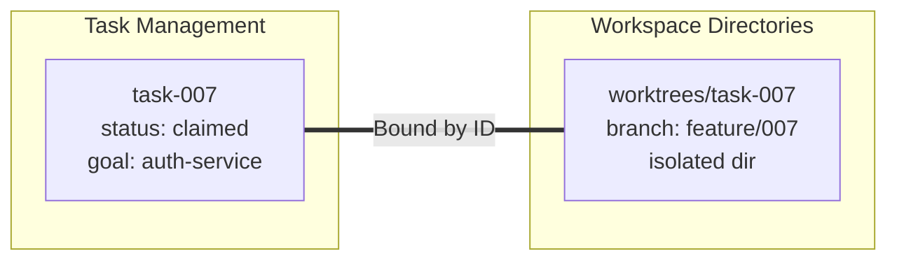

# AgentVerse — Image Analysis Master Reference

> **101 images analyzed across 7 batches** — consolidated from `batch_a_report.md` through `batch_d_report.md`.  
> Last updated: May 25, 2026

---

## Table of Contents

1. [Executive Summary](#1-executive-summary)
2. [Architecture Patterns & Orchestration](#2-architecture-patterns--orchestration)
3. [Workspace Isolation & Git Worktrees](#3-workspace-isolation--git-worktrees)
4. [Agent Communication Protocols](#4-agent-communication-protocols)
5. [Failure Modes & Guardrails](#5-failure-modes--guardrails)
6. [Agent Mental Models](#6-agent-mental-models)
7. [Observability & Monitoring](#7-observability--monitoring)
8. [Enterprise Dashboard Patterns](#8-enterprise-dashboard-patterns)
9. [Visual Flow Canvas & IDE Patterns](#9-visual-flow-canvas--ide-patterns)
10. [FinOps & Cost Analytics](#10-finops--cost-analytics)
11. [Framework Comparison](#11-framework-comparison)
12. [Platform Capabilities (SmythOS Reference)](#12-platform-capabilities-smythos-reference)
13. [Key Code References](#13-key-code-references)
14. [Appendix: Source Batch Reports](#appendix-source-batch-reports)

---

## 1. Executive Summary

The 101 analyzed images form a cohesive knowledge base for the **AgentVerse** platform, covering:

| Theme | Image Count | Source Batches |
|-------|------------|----------------|
| AI Sandboxes & Task Systems | 14 | A |
| Observability (TMUX CLI) | 13 | A |
| Orchestration Presentations | 14 | B1a, B1b |
| SmythOS Prototypes (UI) | 20 | B2a, B2b |
| Git Worktrees & Protocols | 18 | C |
| Enterprise Dashboards & State Machines | 19 | D |
| **TOTAL** | **~101** | **A-D** |

### Three Commandments (User Vision)
1. **ALL interaction modes** — Terminal AND Dashboard AND 3D Command Center
2. **Unlimited drill-down** — Every metric is clickable, every agent is inspectable
3. **No limitations** — "Limitations never existed. This is a very old mindset."

---

## 2. Architecture Patterns & Orchestration

> Source: `batch_b1a_report.md` (prototico32, prototico33)

### Five Orchestration Patterns

| Pattern | Control | Debugging | Use Cases |
|---------|---------|-----------|-----------|
| **Orchestrator-Worker** | High | Easiest | Customer support, task decomposition |
| **Pipeline** | Sequential | Medium | Content production, compliance, ETL |
| **Swarm** | Emergent | Hardest | Research, broad exploration, data gathering |
| **Mesh** | Peer-to-peer | Medium | Collaborative writing, code review |
| **Hierarchical** | Tree | Complex | Enterprise scale, 50+ agents, multi-domain |

> *"Every production multi-agent system maps to one of five patterns — or a hybrid of two or more."*

### Orchestrator-Worker Deep Dive
- **Flow**: `Incoming Request → [Classify → Decompose → Route → Aggregate] → Workers`
- **Workers are stateless** — they don't know about each other
- **Failure cascade**: retries → fallback agent → cheaper model → human escalation
- **Circuit breakers** block degraded workers from polluting output

### Customer Support Example (prototico35)
```
Customer Request: "Refund + Replacement + Callback"
    ├── Refund Agent → ✓ $65 refund initiated
    ├── Inventory Agent → ✓ Ships from Chicago (overnight)
    └── Calendar Agent → ✓ Thu 2:00 PM booked
         ↓
    One Seamless Response
    "Customer never knows multiple agents were involved"
```

---

## 3. Workspace Isolation & Git Worktrees

> Source: `batch_c_report.md`, `batch_d_report.md`

### The Binding: Task ID = Worktree ID



### Why Worktrees?
- **Problem**: Concurrent agents on same repo cause `fatal: Unable to create lock file` errors
- **Solution**: Each agent gets its own physical directory mapped to a task-specific branch
- **Shared**: Same underlying Git history and objects (efficient storage)
- **Adopted by**: Composio AO, Claude Squad, Reddit AI community

### Decentralized State Cycle
```
Idle → Scan → Claim → Resume → [Work] → Complete
```
- **Atomic claiming** via lockfiles (no central coordinator)
- **No race conditions**: First-write-wins via optimistic locking
- **Self-healing**: Dead agents' unclaimed tasks automatically return to pool

---

## 4. Agent Communication Protocols

> Source: `batch_b1a_report.md` (prototico31), `batch_c_report.md`

### Essential Protocols for Multi-Agent Interop

| Protocol | Analogy | Role | Backed By |
|----------|---------|------|-----------|
| **MCP** (Model Context Protocol) | "USB-C for AI context" | Vertical: tool integration | modelcontextprotocol.io |
| **A2A** (Agent-to-Agent, Google) | AgentCards | Horizontal: agent negotiation | Salesforce, SAP, ServiceNow, 50+ |
| **Git Worktrees** | Physical isolation | Conflict prevention | Composio AO, Claude Squad |
| **AGENTS.md** | Shared state file | Context/ownership boundaries | Community standard |

### Structured 4-Field Protocol
```json
{
  "id": "msg-001",
  "type": "task_assignment",
  "payload": { "task": "implement POST /users", "context": "..." },
  "correlationId": "req-042"
}
```
> Natural language dialogue is fragile. Use universal schema for robust inter-agent message tracking.

---

## 5. Failure Modes & Guardrails

> Source: `batch_b1b_report.md` (prototico36, prototico39, prototico40)

### Three Critical Failures

| Failure Mode | Mechanism | Fix |
|-------------|-----------|-----|
| **Cascading Hallucinations** | Agent A fabricates → B treats as truth → compounds | Verify inputs at every handoff boundary |
| **Handoff Loops** | A → B → A endlessly (burns tokens) | Guard conditions + max hop limits |
| **Cost Explosion** | 5-20x more tokens than single agent | Tiered model routing + cost monitoring from day 1 |

### Additional Failure Modes (Naive Multi-Agent)
| # | Failure | Description |
|---|---------|-------------|
| 03 | **Duplicate Work** | Two agents claim same task, produce identical PRs |
| 04 | **Deadlocked Comms** | Agent waits forever for reply from exited agent |

> *"Every single failure is solvable."* — SuperSet runs 10+ agents on isolated worktrees with zero conflicts.

---

## 6. Agent Mental Models

> Source: `batch_b1b_report.md` (prototico41–44)

### ❌ Wrong: Contractor Model (Disposable Subagent)
```
LEAD → SUBAGENT → exits ← absorbs result
Consequences: No memory | No identity | Context bloat
```

### ✅ Right: Teammate Model (Persistent Employee)

| Attribute | Contractor | Full-Time Employee |
|-----------|-----------|-------------------|
| Persistence | Appears once, leaves | Persistent desk |
| Memory | None | Inbox (mailbox) |
| Context | Dumped to lead | Project context |
| Relationship | Disposable | Team member |

### Teammate Mailbox Pattern (Python)
```python
# s09 - teammate mailbox pattern
teammates = {
    'backend': Agent(name='backend', mailbox=[]),
    'tester':  Agent(name='tester', mailbox=[]),
}

# Lead sends — doesn't absorb the work
teammates['backend'].send({
    'task': 'implement POST /users',
    'context': spec_chunk
})

result = teammates['backend'].process_next()
```

**Benefits**: Lead context stays clean | Teammates survive resets

### Validated by Anthropic's 3-Agent Harness (April 2026)
```
Planner (persistent context) → Generator (persistent context) → Evaluator (persistent context)
```

---

## 7. Observability & Monitoring

> Source: `batch_a_report.md` (pending), `batch_d_report.md`

### Observability Dashboard (localhost:5173)
- **Real-time agent activity pulses** — heartbeat visualization
- **Sandbox event streams** — pre/post tool use logs
- **Status telemetry** per agent
- **TMUX-based CLI monitoring** — split-pane terminal with per-agent views

### Parallel Agent Workspace Dashboard (prototico38)
```
┌─────────────────┬─────────────────┐
│ Agent 1 (Blue)  │ Agent 2 (Gold)  │
│ Claimed: auth   │ Claimed: dash   │
│ Writing:        │ Writing:        │
│ UserService.ts  │ DashboardComp.  │
├────────┬────────┼─────────────────┤
│ Agt 3  │ Agt 4  │ Agent 5 (Pink)  │
│ (Green)│(Purple)│ Compacting ctx  │
│ pytest │ Review │ 12K → 3.2K tok  │
│ 47 ✓   │ PR #31 │                 │
└────────┴────────┴─────────────────┘
```

---

## 8. Enterprise Dashboard Patterns

> Source: `batch_b1a_report.md` (operations_dash, portfolio_arch, recipe_engine), `batch_d_report.md`

### Mock Enterprise Micro-Frontends
All built with: **Vue 3 + TypeScript + Vite** frontend → **FastAPI + SQLite** backend

| Dashboard | Key Features |
|-----------|-------------|
| **Mission Briefing** | KPIs, operational cards (Phoenix/Titan/Omega), team/risk tracking |
| **Portfolio Architect** | Investment simulator, donut chart, rebalancing alerts, Monte Carlo |
| **Recipe Engine** | Search/filter, cuisine/dietary pills, recipe cards |
| **Code Review Arena** | PR management, metric evaluations |
| **War Room Incident Command** | Real-time logs, MTTR/MTTA, runbooks, on-call |
| **Agentic Support** | Customer service triage, agent activity tracking |

### Design Language
- **Theme**: Ultra-dark mode (`#0c1017` and blue-grey backgrounds)
- **Accents**: Vibrant orange (active), green (positive), red (risk), muted blue (planning)
- **Interactivity**: Cyan/teal halo ring cursor indicators

---

## 9. Visual Flow Canvas & IDE Patterns

> Source: `batch_b2a_report.md`, `batch_b2b_report.md`

### SmythOS Agent Weaver IDE

| Feature | Description |
|---------|------------|
| **Visual Builder** | Drag-and-drop node canvas for AI workflows |
| **Component-Level Undo** | Per-card revert with "Click to Undo Changes" |
| **Vibe Debug** | Visual workflow inspection and bug fixing |
| **Rollback Timeline** | Version history with restore buttons |
| **Linter** | Auto-corrects prompts, data types, auth scopes |
| **Prettify** | One-click card rearrangement |
| **So Meta** | "Weaver is the agent that builds agents" |

### Canvas Architecture
```
Left Rail (Icons) → Components Panel → Canvas (Node Graph) → Inspector
                                          ↓
                    Nodes: Agent Skill | GenAI LLM | Code | Classifier
                    Connectors: Input/Output dots with spline curves
                    Advanced: Sleep | For Each | Async/Await | JSON Filter
```

### Deployment Modes
- **One-Click Deploy** with API endpoint generation
- **Multi-channel**: API, Chat Widget, Scheduled (Cron), Webhook, Slack, Discord
- **SDK/Runtime**: Run visual agents locally via CLI

---

## 10. FinOps & Cost Analytics

> Source: `batch_b2a_report.md` (cost_analytics), `batch_b2b_report.md`

### Cost Analytics Dashboard
- **Per-model cost tracking** (GPT-4, Claude, Gemini, etc.)
- **Token usage histograms** — daily/weekly/monthly
- **Budget alerting** — threshold notifications
- **Cost-per-agent breakdown** — identify expensive agents
- **Tiered model routing** — cheap model for simple tasks, expensive for complex

### Pricing Tiers (SmythOS Reference)
| Tier | Key Features |
|------|-------------|
| Free | Visual Builder, Debugger, Integrations |
| Builder | + Chat-to-Agent, NodeJS, Private Agents |
| Startup | + RAG |
| Scaleup | + Enterprise Collection |
| Enterprise | + Computer Automation |

---

## 11. Framework Comparison

> Source: `batch_b1a_report.md` (prototico34)

| Framework | Model | Best For |
|-----------|-------|----------|
| **LangGraph** | Directed graph | Complex stateful workflows, checkpointing |
| **CrewAI** | Role-based crews | Fastest prototyping, MCP + A2A native |
| **OpenAI Agents SDK** | Explicit handoffs | Simplest setup, built-in guardrails |
| **Google ADK** | Agent tree | A2A native, multimodal, Gemini optimized |
| **Claude Agent SDK** | Tool-use chain | MCP-native, sub-agents as tools |

> *"Determine the required orchestration pattern first, then select the framework that implements it best."*

---

## 12. Platform Capabilities (SmythOS Reference)

> Source: `batch_b2a_report.md`, `batch_b2b_report.md`

### Feature Matrix
- **Visual Builder** — No-code drag-and-drop agent creation
- **Chat-to-Agent (Weaver)** — Natural language → functional workflow
- **RAG** — Real-time context-relevant data integration
- **Computer Automation** — Multi-step workflows via simple prompts
- **Kanban Board** — Agent task management with swim lanes
- **Observability Logs** — Input/output traces per execution step
- **Template Marketplace** — Pre-built agent templates with one-click deploy
- **Multi-deployment** — API, Widget, Slack, Discord, Webhook, Cron

---

## 13. Key Code References

### Capstone: `s_full.py` — All 12 Mechanisms
```
Loop → Tools → TodoWrite → Subagents → Skills → Compress →
TaskGraph → BgOps → Teams → Protocol → AutoClaim → Worktree
```

### Worktree Task Isolation: `s12_worktree_task_isolation.py`
```
idle → scan → claim → resume
```

### Teammate Mailbox: `s09_agent_teams.py`
```python
teammates = {
    'backend': Agent(name='backend', mailbox=[]),
    'tester':  Agent(name='tester', mailbox=[]),
}
teammates['backend'].send({'task': '...', 'context': spec_chunk})
result = teammates['backend'].process_next()
```

---

## Appendix: Source Batch Reports

| Report | Images | Themes | Size |
|--------|--------|--------|------|
| [batch_a_report.md](file:///C:/VMs/Projetos/AgentVerse/docs/image_deep_dive/batch_a_report.md) | 27 | AI Sandboxes, Claude Code Tasks, TMUX Observability | *(pending)* |
| [batch_b1a_report.md](file:///C:/VMs/Projetos/AgentVerse/docs/image_deep_dive/batch_b1a_report.md) | 8 | Operations dash, Portfolio, Engine, Orchestration slides | 19 KB |
| [batch_b1b_report.md](file:///C:/VMs/Projetos/AgentVerse/docs/image_deep_dive/batch_b1b_report.md) | 9 | Failure modes, Mental models, Teammate pattern | 12 KB |
| [batch_b2a_report.md](file:///C:/VMs/Projetos/AgentVerse/docs/image_deep_dive/batch_b2a_report.md) | 10 | SmythOS UI prototypes (Canvas, Chat, Deploy, Kanban) | 26 KB |
| [batch_b2b_report.md](file:///C:/VMs/Projetos/AgentVerse/docs/image_deep_dive/batch_b2b_report.md) | 10 | Visual Vibing, SDK, Prototipos, Billing | 20 KB |
| [batch_c_report.md](file:///C:/VMs/Projetos/AgentVerse/docs/image_deep_dive/batch_c_report.md) | 18 | Git Worktrees, Protocols, Capstone, Scaling | 22 KB |
| [batch_d_report.md](file:///C:/VMs/Projetos/AgentVerse/docs/image_deep_dive/batch_d_report.md) | 19 | State machines, Observability, Enterprise dashboards | 33 KB |

---

> **Next Step**: Once Batch A report lands, this document will be updated with the AI Sandbox and TMUX CLI observability sections. Then → Multi-Agent Brainstorming → BRAINSTORMING_DECISIONS.md
