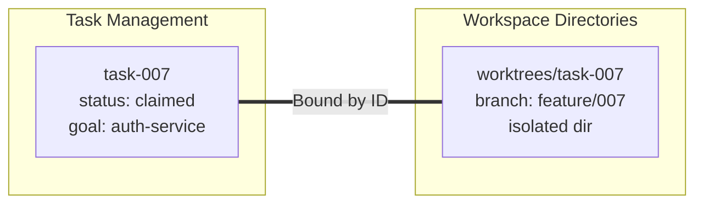
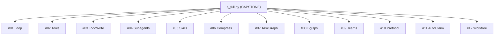

# Multi-Agent Orchestration & Scaling Analysis Report (Batch C)

This report provides a detailed, high-density architectural and visual analysis of 18 images capturing key concepts in multi-agent orchestration, Git workspace isolation (worktrees), communication protocols, system integration (the Capstone project), and the real limits of scaling agent teams.

---

## Executive Summary & Architectural Overview

The analyzed image batch outlines a progression of techniques to solve major challenges in multi-agent environments. 

1. **Workspace Isolation via Git Worktrees**: Concurrently executing agents on the same repository cause file system and lock contention. Git worktrees resolve this by creating isolated physical directories mapped to task-specific branches while sharing the same underlying repository history and objects.
2. **Autonomous Task Allocation**: Orchestration roles transition from manual task assigners (which create bottlenecks) to autonomous pull-based task boards where agents claim tasks atomically.
3. **Structured Agent Communication**: Free-form natural language dialogue is error-prone. A structured 4-field protocol with correlation IDs ensures response-to-request traceability and prevents timeouts.
4. **Capstone Integration (`s_full.py`)**: A circular lifecycle combining 12 agentic mechanisms (Loop, Tools, TodoWrite, Subagents, Skills, Compress, TaskGraph, BgOps, Teams, Protocol, AutoClaim, Worktree).
5. **Scaling Trade-offs**: Diminishing returns occur beyond 5–7 agents due to compounding API costs, PR review overhead, and context reset inefficiencies.

---

## Detailed Image Analysis

### 1. The Binding: Task ID = Worktree ID
* **File Path**: `C:\Users\mbenicios\Downloads\multi_agent_antropic_powerful_concepts\Captura de tela 2026-05-24 155r12png.png`
* **Title Shown**: *The Binding: Task ID = Worktree ID*
* **Core Concept**: Shows how a unique Task ID maps directly to an isolated Git Worktree workspace. Binding the Task ID to the Worktree directory allows automation to coordinate branches and workspaces without collision.
* **Visual Layout & Design**:
  - **Left Card (Orange Border)**: Represents the Task Metadata.
    - Title: `task-007` (Orange)
    - Sub-text: `status: claimed` and `goal: auth-service` (Gray)
  - **Center Icon**: A diagonal white link/chain graphic (`🔗`) indicating a binding relationship.
  - **Right Card (Green Border)**: Represents the Git Workspace.
    - Title: `worktrees/task-007` (Green)
    - Sub-text: `branch: feature/007` and `isolated dir` (Gray)
  - **Bottom Buttons (Green Outlines)**:
    - `TASKS MANAGE GOALS` (Thin border)
    - `WORKTREES MANAGE DIRECTORIES` (Thin border)
    - `BOUND BY ID` (Thick glow/highlighted border)



---

### 2. The Sweet Spot (Agent Concurrency Limits)
* **File Path**: `C:\Users\mbenicios\Downloads\multi_agent_antropic_powerful_concepts\Captura de tela 2026-05-24 155r13png.png`
* **Title Shown**: *The Sweet Spot*
* **Core Concept**: Illustrates the productivity/efficiency threshold when running multiple parallel agents on a developer machine. The sweet spot is 5-7 agents, beyond which performance degrades due to rate limits and disk footprint.
* **Visual Layout & Design**:
  - **Left Card (Green Border)**:
    - Text: `5–7 agents` (Large, Green)
    - Sub-text: `productive ceiling per laptop` (White) and `✓ sweet spot` (Green)
  - **Right Card (Red Border)**:
    - Text: `8+ agents` (Large, Red)
    - Sub-text: `rate limits + ~5GB/worktree disk` (White) and `diminishing returns` (Red)
  - **Bottom Code Block**: Python implementation of worktree isolation inside a window titled `s12_worktree_isolation.py` (with green tag `PYTHON`).
* **Python Code Transcription (`s12_worktree_isolation.py`)**:
  ```python
  # s12 - worktree isolation
  def claim_with_worktree(task, agent_name, repo_path):
      worktree_path = f'{repo_path}/worktrees/{task["id"]}'
      branch = f'feature/{task["id"]}'
      
      subprocess.run([
          'git', 'worktree', 'add',
          worktree_path, '-b', branch
      ], cwd=repo_path)
      
      task['worktree'] = worktree_path
      task['status'] = 'claimed'
      task['agent'] = agent_name
      return worktree_path
  ```

---

### 3. Each Agent Gets Its Own Desk
* **File Path**: `C:\Users\mbenicios\Downloads\multi_agent_antropic_powerful_concepts\Captura de tela 2026-05-24 155r2png.png`
* **Title Shown**: *✓ Each Agent Gets Its Own Desk* (Green checkmark)
* **Core Concept**: Shows how Git worktrees utilize a shared underlying `.git` object store but decouple the active working directories. Multiple agents read/write to the same history but execute commands in physical isolation.
* **Visual Layout & Design**:
  - **Top Node (Green Border)**: `.git object store (SHARED)` (White bold) with sub-text `repo history shared — working directories isolated`.
  - **Data Flow**: A down arrow leading to a horizontal array of 5 agent workspace cards, each color-coded:
    1. **Blue Border**: `/worktrees/auth` (Blue) | `branch: feature/auth` | `agent: agent-1`
    2. **Orange Border**: `/worktrees/dashboard` (Orange) | `branch: feature/dashboard` | `agent: agent-2`
    3. **Purple Border**: `/worktrees/tests` (Purple) | `branch: feature/tests` | `agent: agent-3`
    4. **Green Border**: `/worktrees/review` (Green) | `branch: feature/review` | `agent: agent-4`
    5. **Magenta Border**: `/worktrees/docs` (Magenta) | `branch: feature/docs` | `agent: agent-5`

```mermaid
graph TD
    CentralGit[".git object store (SHARED)<br>repo history shared"]
    CentralGit --> WT1["/worktrees/auth<br>branch: feature/auth<br>agent: agent-1"]
    CentralGit --> WT2["/worktrees/dashboard<br>branch: feature/dashboard<br>agent: agent-2"]
    CentralGit --> WT3["/worktrees/tests<br>branch: feature/tests<br>agent: agent-3"]
    CentralGit --> WT4["/worktrees/review<br>branch: feature/review<br>agent: agent-4"]
    CentralGit --> WT5["/worktrees/docs<br>branch: feature/docs<br>agent: agent-5"]
    style CentralGit fill:#113311,stroke:#00aa00,stroke-width:2px;
```



---

### 4. Lock Contention Problem
* **File Path**: `C:\Users\mbenicios\Downloads\multi_agent_antropic_powerful_concepts\Captura de tela 2026-05-24 15r2png.png`
* **Title Shown**: *✕ Five Agents, One Repo = Lock Contention* (Red cross)
* **Core Concept**: Depicts what happens when multiple agents operate concurrently in the same repository folder without worktree isolation. Git locks its index file (`.git/index.lock`), blocking parallel operations and failing tasks.
* **Visual Layout & Design**:
  - **Center**: A folder icon with label `.git` in a red glowing card.
  - **Periphery**: Five circular robot avatar icons representing agents distributed around the central folder.
  - **Bottom Terminal Log**: Displays the standard git lock error (in red):
    ```text
    fatal: Unable to create lock file - already locked by another process
    ```

---

### 5. Fountain Case Study & Task Claiming Loop
* **File Path**: `C:\Users\mbenicios\Downloads\multi_agent_antropic_powerful_concepts\Captura de tela 2026-05-24 1r2png.png`
* **Title Shown**: *Fountain (real-world example)* | *2× candidate conversions*
* **Core Concept**: Connects multi-agent coordination with business outcomes, citing a "2x candidate conversions" metric. Underneath, it details the Python logic for agents to autonomously pull tasks from a shared board.
* **Visual Layout & Design**:
  - **Top Card (Purple Border)**:
    - Text: `Fountain (real-world example)` (White)
    - Subtext: `2× candidate conversions` (Large, Purple)
    - Orchestration: `hierarchical multi-agent orchestration` (Gray)
    - Citation: `Source: Anthropic 2026 Agentic Coding Trends Report` (Gray, Small)
  - **Bottom Code Block**: Python implementation of task claiming inside a window titled `s11_autonomous_claiming.py` (with purple tag `PYTHON`).
* **Python Code Transcription (`s11_autonomous_claiming.py`)**:
  ```python
  # s11 - autonomous task claiming
  def agent_loop(agent, task_board_path):
      while True:
          tasks = load_json(task_board_path)
          available = [
              t for t in tasks
              if t['status'] == 'available'
              and agent.can_handle(t['type'])
          ]
          if available:
              task = available[0]
              if atomic_claim(task, agent.name, task_board_path):
                  result = agent.execute(task)
                  mark_done(task['id'], result, task_board_path)
          else:
              time.sleep(POLL_INTERVAL)
  ```

---

### 6. The Lead Agent's Role Changes
* **File Path**: `C:\Users\mbenicios\Downloads\multi_agent_antropic_powerful_concepts\Captura de tela 2026-05-24 1rpng.png`
* **Title Shown**: *The Lead Agent's Role Changes*
* **Core Concept**: Shows the architectural transition from push-based (top-down manual allocation) to pull-based (autonomous queue execution) task allocation as teams grow.
* **Visual Layout & Design**:
  - **Left Card (Red Border)**: Represents the traditional centralized design.
    - Icon: Sequential clipboard flow (`📋 -> 📋 -> 📋`).
    - Title: `Task-ASSIGNER` (Red bold)
    - Details: `assigns each task manually` and `bottleneck at scale` (Gray)
  - **Transition**: A right-pointing arrow (`→`) in the center.
  - **Right Card (Green Border)**: Represents the decentralized pull design.
    - Icon: Pencil writing on paper (`📝`).
    - Title: `Task-WRITER` (Green bold)
    - Details: `writes to the board` and `team finds the work` (Gray)

---

### 7. Universal Protocol Schema
* **File Path**: `C:\Users\mbenicios\Downloads\multi_agent_antropic_powerful_concepts\Captura de tela 2026-05-24 2037112.png`
* **Title Shown**: *✓ The Protocol Schema — 4 Fields, Universal* (Orange text)
* **Core Concept**: Defines the minimum viable messaging schema required for traceable multi-agent conversations.
* **Visual Layout & Design**:
  - **Card Container**: Orange outline enclosing a color-coded JSON object definition.
* **Schema Transcription**:
  ```json
  {
      id:            "007", // unique identifier
      type:          "request", // request | response
      payload:       "validate schema in migrations/v3", // actual content
      correlationId: "007", // links response to request
  }
  ```
  - **Visual Color Highlights**: `id` (Blue), `type` (Yellow/Orange), `payload` (White), `correlationId` (Purple).

---

### 8. Message Ambiguity / Talk Past Each Other
* **File Path**: `C:\Users\mbenicios\Downloads\multi_agent_antropic_powerful_concepts\Captura de tela 2026-05-24 203712.png`
* **Title Shown**: *✕ Without a Protocol: Agents Talk Past Each Other* (Red cross)
* **Core Concept**: Illustrates the failure mode of using unstructured, conversational natural language between agents. Ambiguous references (such as "latest") cause state locks or execution timeouts.
* **Visual Layout & Design**:
  - Displays a vertical message conversation sequence:
    1. **Bubble 1 (Blue Outline)**: `Agent A: done with the database schema`
    2. **Bubble 2 (Orange Outline)**: `Agent B: which version? I see three files...`
    3. **Bubble 3 (Blue Outline)**: `Agent A: the latest one`
    4. **Bubble 4 (Red Outline + Stopwatch Icon)**: `Agent B times out — it never knew what "latest" meant`

---

### 9. Protocol in Action (Correlation IDs)
* **File Path**: `C:\Users\mbenicios\Downloads\multi_agent_antropic_powerful_concepts\Captura de tela 2026-05-24 20371e12.png`
* **Title Shown**: *The Protocol in Action* (Orange text)
* **Core Concept**: Demonstrates how correlation IDs solve the ambiguity problem shown in Image 8, linking replies to original requests.
* **Visual Layout & Design**:
  - **Top Card (Blue Outline)**: `Agent A sends: { id: '007', type: 'request', payload: 'validate schema v3' }`
  - **Connector**: Double-headed orange vertical arrow (`↕`).
  - **Middle Card (Orange Outline)**: `Agent B replies: { type: 'response', correlationId: '007', payload: 'valid, 12 tables' }`
  - **Bottom Card (Green Outline + Green Check)**: `correlationId '007' matched — Agent A knows exactly which request was answered`

---

### 10. Request-Response Implementation Code
* **File Path**: `C:\Users\mbenicios\Downloads\multi_agent_antropic_powerful_concepts\Captura de tela 2026-05-24 2037ee12.png`
* **Title Shown**: Comparison banner (`✕ Without protocol` / `✓ With protocol`) and python code.
* **Core Concept**: Python implementation of a mailbox request-response pattern using UUID generation for tracking and matching message IDs.
* **Visual Layout & Design**:
  - **Left Compare Card (Red Outline)**: `✕ Without protocol` | `agents talk past each other`
  - **Right Compare Card (Green Outline)**: `✓ With protocol` | `every message traceable`
  - **Code Window**: Titled `s10_protocol.py` (with yellow `PYTHON` tag).
* **Python Code Transcription (`s10_protocol.py`)**:
  ```python
  # s10 - request-response protocol
  def send_request(teammate, payload):
      msg_id = str(uuid4())
      teammate.mailbox.append({
          'id': msg_id, 'type': 'request',
          'payload': payload
      })
      return msg_id
      
  def handle_response(msg_id, mailbox):
      for msg in mailbox:
          if msg.get('correlationId') == msg_id:
              return msg['payload']
  ```

---

### 11. Capstone Slide
* **File Path**: `C:\Users\mbenicios\Downloads\multi_agent_antropic_powerful_concepts\Captura de tela 2026-05-24 2043301.png`
* **Title Shown**: *SERIES FINALE* | *THE CAPSTONE*
* **Core Concept**: Introductory slide introducing the unification of 12 distinct agentic mechanisms inside a single unified codebase (`s_full.py`).
* **Visual Layout & Design**:
  - **Top Text**: `SERIES FINALE` (Small, Slate Gray)
  - **Center Title**: `THE CAPSTONE` (Large, White bold)
  - **Subtitle**: `All twelve mechanisms. One file.` (Light Blue, Italicized)

---

### 12. The 12 Mechanisms Map (`s_full.py`)
* **File Path**: `C:\Users\mbenicios\Downloads\multi_agent_antropic_powerful_concepts\Captura de tela 2026-05-24 20433012.png`
* **Title Shown**: *s_full.py* | *CAPSTONE*
* **Core Concept**: Mapping diagram showing the twelve modular mechanisms composing a mature agent architecture.
* **Visual Layout & Design**:
  - **Center**: Dark blue rectangular capsule containing `s_full.py` / `CAPSTONE`.
  - **Circle of Nodes**: Twelve circular glow-bordered icons arranged in a clock-face pattern:
    1. **`Loop` (#01)**: Blue border | Circular refresh arrow icon.
    2. **`Tools` (#02)**: Silver/Gray border | Wrench tool icon.
    3. **`TodoWrite` (#03)**: Light Purple border | Clipboard with checkbox list icon.
    4. **`Subagents` (#04)**: Blue/Purple border | Robot face avatar.
    5. **`Skills` (#05)**: Indigo/Violet border | Lightning bolt icon.
    6. **`Compress` (#06)**: Blue/Silver border | Inward double arrow icon (compression).
    7. **`TaskGraph` (#07)**: Purple border | Network node/edge configuration icon.
    8. **`BgOps` (#08)**: Dark Violet border | Gear mechanism icon.
    9. **`Teams` (#09)**: Light Blue border | Group silhouette icon.
    10. **`Protocol` (#10)**: Orange border | Satellite dish transmitter icon.
    11. **`AutoClaim` (#11)**: Magenta/Red border | Bullseye target with arrow icon.
    12. **`Worktree` (#12)**: Green border | Sprouting branch icon.



---

### 13. System Execution logs
* **File Path**: `C:\Users\mbenicios\Downloads\multi_agent_antropic_powerful_concepts\Captura de tela 2026-05-24 20433013.png`
* **Title Shown**: *Multi-Agent Orchestration: Teams, Protocols & Worktrees Explained*
* **Core Concept**: Shows the real-time execution of the unified system (`s_full.py`), tracking initialization, scanning, claiming, workspace setup, and token budget management.
* **Visual Layout & Design**:
  - Displays the 12-mechanism diagram from Image 12.
  - A terminal window overlays the bottom sector (covering the `TaskGraph` node).
  - Terminal has macOS dots and a blue tag labeled `PYTHON`.
  - In the bottom right corner, there are thumbs-up and thumbs-down outline icons.
* **Terminal Log Transcription**:
  ```bash
  python agents/s_full.py
  # Agent starts.
  # Scanning task board...
  # Claimed: feature/auth-service
  # Worktree: /worktrees/task-007
  # Context: 0 / 200,000 tokens
  # Running ...
  ```

---

### 14. Before You Scale Title Slide
* **File Path**: `C:\Users\mbenicios\Downloads\multi_agent_antropic_powerful_concepts\Captura de tela 2026-05-24 20433014.png`
* **Title Shown**: *BEFORE YOU SCALE* | *The Real Limits*
* **Core Concept**: Transition slide warning developers of the practical constraints of scale.
* **Visual Layout & Design**:
  - **Top Text**: `BEFORE YOU SCALE` (Small, Red)
  - **Center Title**: `The Real Limits` (Large, White bold)
  - **Subtitle**: `Don't ignore these.` (Light Blue, Italicized)

---

### 15. The Three Limits of Agent Scaling
* **File Path**: `C:\Users\mbenicios\Downloads\multi_agent_antropic_powerful_concepts\Captura de tela 2026-05-24 204450445.png`
* **Title Shown**: *THREE THINGS*
* **Core Concept**: Summarizes the three structural pain points encountered when scaling multi-agent operations: API budget, Git code integration/reviews, and Agent context initialization.
* **Visual Layout & Design**:
  - **Header**: `THREE THINGS` (Red bold)
  - Three distinct horizontal cards, each featuring a red cross icon (`✕`) on the left:
    1. **Card 1**:
       - Title: `API cost compounds` (White bold)
       - Subtext: `5 agents × 200K tokens × N runs = budget shock`
    2. **Card 2**:
       - Title: `Merge conflicts move to integration` (White bold)
       - Subtext: `Review overhead is real — 5 branches need 5 reviews`
    3. **Card 3**:
       - Title: `Context resets = fresh start` (White bold)
       - Subtext: `Build handoff artifacts or agents pick up confused`

---

### 16. The Three Limits - Transition Stage 2
* **File Path**: `C:\Users\mbenicios\Downloads\multi_agent_antropic_powerful_concepts\Captura de tela 2026-05-24 20445045.png`
* **Title Shown**: *THREE THINGS*
* **Core Concept**: A frame from the presentation transition showing only the first two points.
* **Visual Layout & Design**:
  - Displays Card 1 (`API cost compounds`) and Card 2 (`Merge conflicts move to integration`). Card 3 is hidden.

---

### 17. The Three Limits - Transition Stage 1
* **File Path**: `C:\Users\mbenicios\Downloads\multi_agent_antropic_powerful_concepts\Captura de tela 2026-05-24 2044505.png`
* **Title Shown**: *THREE THINGS*
* **Core Concept**: A frame from the presentation transition showing only the first scaling challenge.
* **Visual Layout & Design**:
  - Displays only Card 1 (`API cost compounds`). Cards 2 and 3 are hidden.

---

### 18. Conclusion: Working Within the Limits
* **File Path**: `C:\Users\mbenicios\Downloads\multi_agent_antropic_powerful_concepts\Captura de tela 2026-05-24 2044505445.png`
* **Title Shown**: *Know the limits → work within them*
* **Core Concept**: Final slide prescribing design patterns to counter the three limits identified in Image 15.
* **Visual Layout & Design**:
  - **Center**: A green square enclosing a white checkmark (`✓`).
  - **Main Title**: `Know the limits → work within them` (Green bold text)
  - **Subtitle**: `Budget first. Review branches. Build handoff artifacts.` (Light Blue, Italicized)

---

## Architectural Mapping Matrix

| Image Index | Image File Name | Key Concept | Primary Mechanism | Visual Focus |
| :--- | :--- | :--- | :--- | :--- |
| **01** | `...155r12png.png` | Task to Workspace Binding | Worktrees (#12) | Binding metadata schema |
| **02** | `...155r13png.png` | Scale Sweet Spot | Worktrees & AutoClaim | Python worktree creation code |
| **03** | `...155r2png.png` | Shared Object Store | Shared Repo vs Isolated Workspaces | Multi-branch routing flow |
| **04** | `...15r2png.png` | Repository Lock contention | Concurrency failures | Red warning and git index lock error |
| **05** | `...1r2png.png` | Case Study & Task Loop | Loop (#01) & AutoClaim (#11) | Python load-claim-execute loop |
| **06** | `...1rpng.png` | Pull-based Task Assignment | AutoClaim (#11) & TodoWrite (#03) | Transition diagram (Assigner vs Writer) |
| **07** | `...2037112.png` | Universal Message Schema | Protocol (#10) | JSON message structure |
| **08** | `...203712.png` | Unstructured dialogue failure | Protocol (#10) | Simulated chat bubble error flow |
| **09** | `...20371e12.png` | Correlation ID matching | Protocol (#10) | Interactive request-reply sequence |
| **10** | `...2037ee12.png` | Mailbox handling code | Protocol (#10) | Python send/handle implementation |
| **11** | `...2043301.png` | Capstone Title | Integration (All mechanisms) | Slide design |
| **12** | `...20433012.png` | 12 Agentic Mechanisms | System Architecture | Circular diagram mapping mechanisms |
| **13** | `...20433013.png` | Capstone Run output | Execution Monitoring | Terminal execution output |
| **14** | `...20433014.png` | Scaling limits Title | Scale constraints | Slide design |
| **15** | `...204450445.png` | Scale bottlenecks | Cost, Reviews, & Reset | 3-item bulleted error cards |
| **16** | `...20445045.png` | Scale bottlenecks (Part 2) | Cost & Reviews | 2-item transition slide |
| **17** | `...2044505.png` | Scale bottlenecks (Part 1) | Cost | 1-item transition slide |
| **18** | `...2044505445.png` | Scaling Mitigation Strategy | Mitigation Principles | Green success slide |
